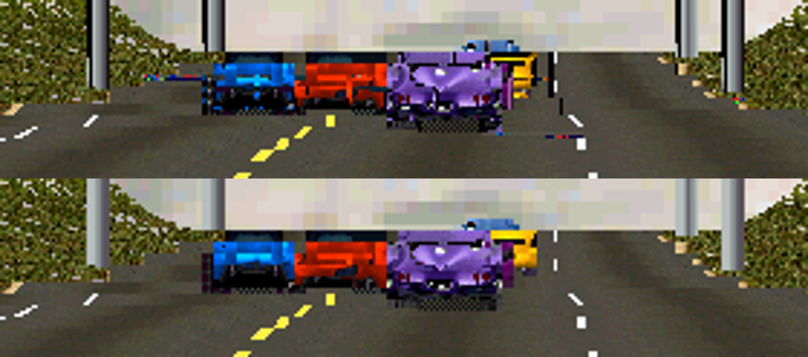
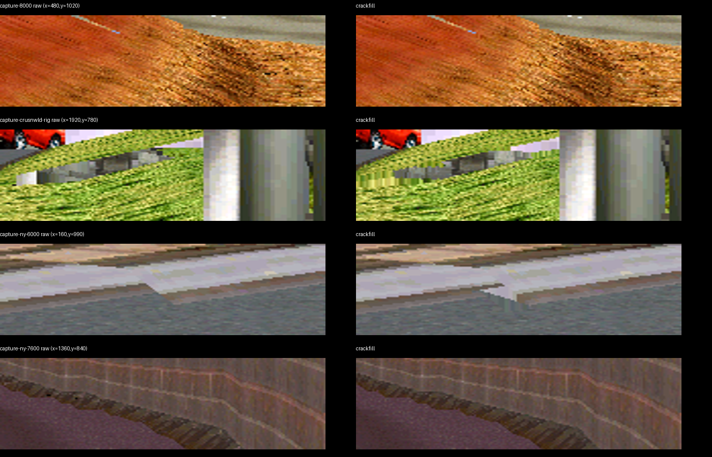
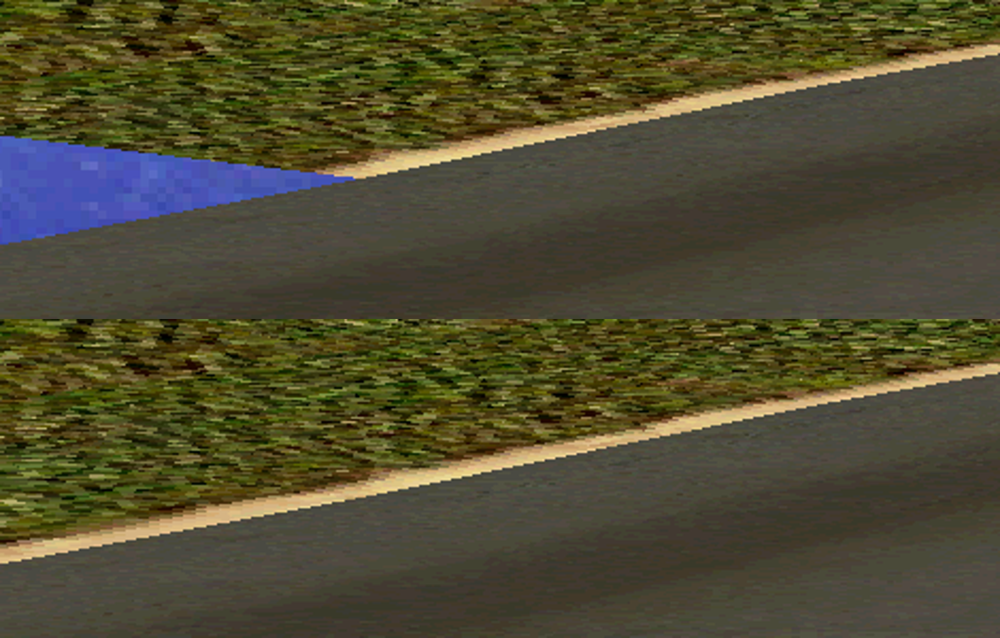

# Findings from the recorded LA Freeway drive

Investigation begun 5 September 2026, continuing after midnight UTC. The user's
`results/diagnostics/my-drive` remains unchanged. It contains 5,012 effective
input frames and 83 native snapshots, covering the entire car-selection
countdown and about 40 seconds driving LA Freeway. Every wheel/pedal input,
emulated timestamp and sampled native image matched on identity playback.
Physical FFB was deliberately disabled in recording and replay.

## Regular stutter and sustained slowdown were separate problems

PNG encoding ran on the emulation thread. Over frames 1680–4800, the original
recording's capture-adjacent callback interval had median **79.52 ms**, versus
**22.01 ms** on other frames. Raw snapshot capture followed by PNG encoding
after exit reduced that capture-adjacent median to **18.25 ms**. All 83 decoded
images still matched the original. Raw disk writes remain synchronous; this
removes the measured encoding hitch, not every possible source of uneven pacing.

MAME's underlying GDI window was also expensive near 4K, even when the GL overlay
was disabled. Changing the underlying backend to D3D retained the true widescreen
GL overlay and produced these results on the same input recording:

| Presentation, raw native capture | Selection 1680–2280 | Racing 2700–4800 |
|---|---:|---:|
| GL scale 4 over GDI | 77.59% emulation speed | 83.73% |
| GL scale 4 over D3D | 100.00% | 99.99% |

All 83 native images matched in both runs. V-Unit now defaults to D3D;
`CRUISN_VUNIT_VIDEO=gdi` retains a compatibility fallback. A new 600-frame
recording through the actual launcher, followed by headless replay, passed.
These measurements are USA on this rig, not acceptance of every game/wheel.
One earlier GL-disabled native control was stretched by the recorded window
settings; native controls now explicitly preserve aspect. It was a diagnostic
control, not a change to the recorded widescreen renderer.

## Colored road seams: texture atlas overreach, not missing coverage

At capture frame 3440, pixel (1460,820) on the 2736×1600 internal canvas was red
(`0x1d36`) and was **covered by current-scene road polygon 782**. Its native
coordinates are `(279,205), (291,205), (291,206), (279,206)`; texture base is
`0x2b3`, palette base `0x1d00`. The road maps 160 texture rows into a quad only
one source pixel tall.

The prior rectangle seam repair expands every axis-aligned rectangle by half a
source pixel and extrapolates UVs to preserve the interior gradient. That is
useful for adjacent menu tiles, but it also applies to distant road rectangles.
Here the expansion samples dozens of rows beyond the intended road tile and
reads unrelated atlas contents. This reproduces in a frozen capture, so live
texture queue ordering is not required to explain this particular artifact.

The fix retains original UV bounds before dilation and clamps **quality-mode**
sampling to that domain. It preserves expanded coverage and interior UV slope.
Native integer DDA is unchanged. The observed red pixel becomes road index
`0x1d19`; the scene's coverage mask is unchanged. Clamped transparent edge texels
can correctly change polygon ownership without changing overall coverage.

Validation: six archived native captures spanning USA, World and Off Road remain
**100.0000%** exact. The rebuilt live executable passes the full 5,012-frame
recording and all 83 native screenshots. A ROM-free GPU regression checks thin
rectangles at 1×/2×/3×/4×/6×, adjacent tile coverage, transparent polygon ownership
and scalar/vectorized builder equivalence. Removing the bounds in a negative
control produces 56/86/224/504 foreign texels at 2×/3×/4×/6×. CI now also runs
these GPU fixtures with Mesa software rendering.

## Crack filler: a limited reconstruction option, not a general graphics fix

With margin extension disabled, as on the user's rig, crack filling changes
**zero pixels** in frame 3440. It cannot repair covered pixels carrying the wrong
texture, or a backdrop already drawn through absent terrain.

Six other frozen captures show 0–594 changed pixels in about 4.38 million output
pixels. Some stale seam pixels disappear, but the replacement is copied from a
nearby surface, not reconstructed from geometry or UVs. It can introduce short
streaks or extend a contrasting surface across a gap. Both results matter:

My reassessment: retain it as an explicit, reversible enhancement while fixing
identified causes; do not increase its radius or cite it as evidence that the
renderer is correct. Prefer actual surface coverage, correct texture domains
and ordered resources. Its nearest-neighbor and checkerboard heuristics do not
establish material identity or intentional transparency. More precise source
geometry is the long-term solution for genuinely quantized shared-edge gaps.

The offline preview previously tied `--crackfill` to backdrop suppression and
margin extension, unlike the live rig's settings. Those are now separate options
(`--marginfill` is explicit), so crack-filler experiments no longer silently
change the margin policy. The runtime crack-filler default is unchanged.

## Blue ground holes: recover objects rejected against the 4:3 view

At frame 3440, internal pixel (30,1075) belongs to backdrop polygon 17, texture
base `0x25f9`, with index `0x4676`. Adjacent pixels above/below belong to grass
and road polygons. This is submitted backdrop visible between terrain surfaces,
not a missing texture upload or a pixel the scene left unwritten.

The successful fix is earlier in the game: USA's object walker tests projected
x plus/minus its projected radius against a horizontal halfwidth of 256. It can
reject a whole grass object needed in the new margins before submitting quads.
The patch redirects just the two visibility operands at words `0xe1`/`0xe5` to
a new 342.0 constant in unused alignment padding at `0x203`. It deliberately
leaves the shared `0x53` value unchanged because other paths use it in projection.
The new file `patch/game/crusnusa-widescreen.txt` enables this for full widescreen.

For a stronger test than unrelated screenshots, the harness applies the patch
four frames before the target capture. Original execution history is preserved
up to that point. Three matched-state tests pass:

| Frame | Original current-scene quads | Added quads | Changed/removed originals | Native pages, textures, palette |
|---|---:|---:|---:|---|
| 3440 | 2,518 | 50 | 0 | Byte-identical |
| 3800 | 2,197 | 5 | 0 | Byte-identical |
| 4880 | 2,032 | 5 | 0 | Byte-identical |

Every added quad lies wholly outside the native x range; every original draw
remains in its original order. The hole at (30,1075) changes from backdrop to a
grass quad with corners `(-203,273), (-111,260), (-44,268), (-119,282)`.
The right hole beneath the overpass is also replaced by actual terrain.

**Full-run determinism has a different scope.** Applying this game-code change
from boot makes 32 of the original recording's later native snapshots differ
(first at frame 3120), despite identical effective inputs and emulated timestamps.
Later car/traffic positions diverge. The extra guest rendering changes execution
history; the precise coupling through timing/state still needs investigation.
The full replay correctly fails its original identity comparison. This is not a
claim of unchanged physics or an automatic reference update. A separate candidate
recording retains the original human INP provenance: all 5,012 frames and 83 native
images match on its identity replay. Late, matched-state comparisons remain the
basis for the visibility fix's isolated visual correctness. One full live experiment held 99.98% during
selection and 99.73% racing, including 26 diagnostic BMP captures.

The earlier broad polygon-cull experiment is rejected: native frames diverged
from 2940, so apparently improved terrain at that later, different game state
was not sufficient proof. A bounded polygon-only replacement was verified active
in RAM but changed neither the geometry nor the hole at 3440. Read taps confirmed
no relevant near-left candidates in that sampled path. The object-level test
above is the cause-directed fix; those experimental trampolines are not shipped.

This also exposes a weakness in backdrop tagging: the actual backdrop here uses
low texture-base byte `0xf9`, not the hardcoded USA `0x56` heuristic. Track-specific
texture addresses are not durable layer identities. Masking or stretching the
backdrop would be a poor substitute for recovering this grass object.

## Distance: a working gate that still does not extend this scene

Separate, effective-RAM-verified experiments at frame 3440 leave the visibility
and LOD patches out. The stock 80,000 far gate yields 2,518 current-scene quads;
20,000 yields 784; 160,000 still yields 2,518 and identical native images. This
confirms that the gate is active but is not withholding additional geometry here.
It does not prove that every track is streamer-limited. The next useful probe
must identify a specific popping object and trace its residency, node lifetime,
depth/radius rejection, reciprocal lookup and LOD independently. No new distance
extension is enabled. Configured experiments now compose with the widescreen
default and reject conflicting words; an explicit `MIDV_PATCH` remains a complete
developer override.

## Reproduce the evidence

See [diagnostic workflow](../DIAGNOSTIC-REPLAY.md). Frozen ownership/coverage can
be exported with `gpu/renderer.py CAPTURE --scale 4 --wide --buffers output.npz`.
The NPZ includes original quads, current-scene owner IDs (65535 = no owner),
coverage and palette indices. Ownership now respects transparent texels; the
old debug path returned before the transparency discard.

Full local evidence is gitignored. Key runs:

Compact results and provenance are tracked in
[`2026-09-05-recorded-drive-milestone.json`](../../results/proof/2026-09-05-recorded-drive-milestone.json).

| Run under results/diagnostics | Scope |
|---|---|
| replay-20260906T015718Z-29qhi1t8 | Original live GL defects, GDI, PNG capture |
| replay-20260906T020535Z-cyvi_o9s | Correct raw capture, GL + GDI |
| replay-20260906T020825Z-5xlvd_7z | Correct raw capture, GL + D3D |
| replay-20260906T021337Z-d71ect3r | Native-verified frozen frame 3440, ownership and texture A/B |
| replay-20260906T021721Z-oug1q689 | Native-verified frozen frame 3800 |
| replay-20260906T022330Z-wih4t_lq | Rebuilt bounded-UV executable, full native replay PASS |
| crackfill-audit | Six raw/fill comparisons and changed-pixel counts |
| usa-widescreen-candidate-case | Explicit improved-build recording from the original human INP |
| replay-20260906T030510Z-yydopnlr | Candidate identity replay, 5,012 frames and 83 native images PASS |

Failed experiments remain retained too. In particular, `screen:pixels()` read
the wrong double buffer and failed native comparison; the implemented recorder
uses `video:snapshot_pixels()`. The harness did not bless the failed images.
