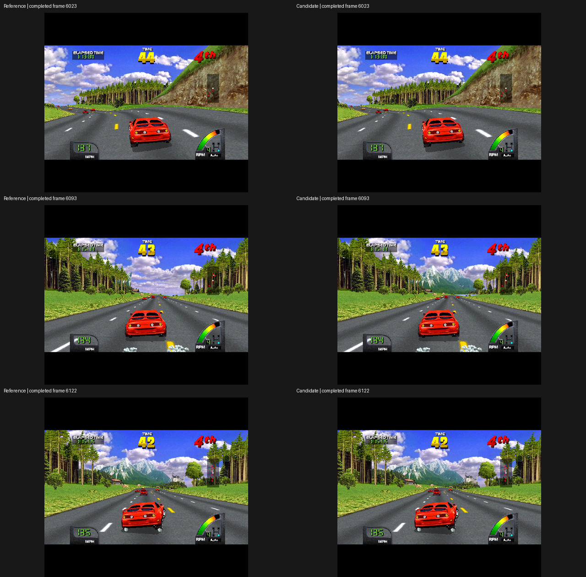
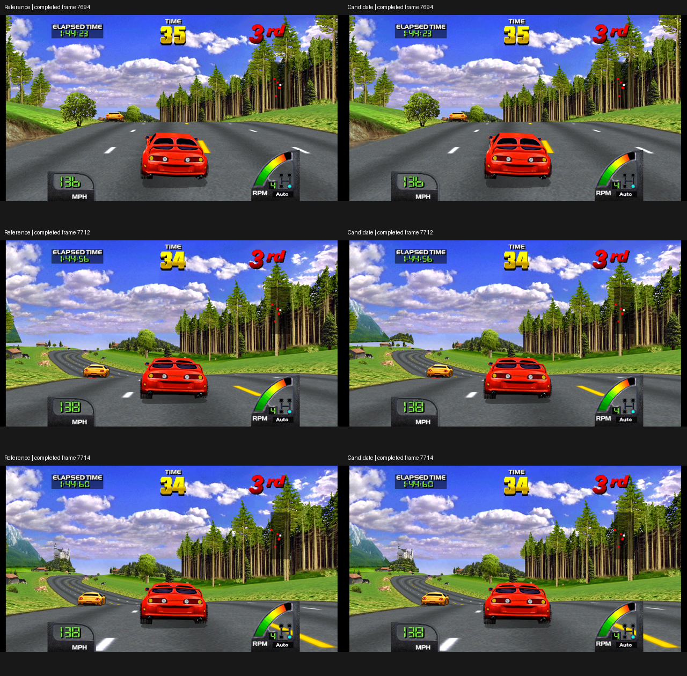

# Earlier mountain activation in World

The World 2.4 Distant Scenery option now advances the activation of the five
identified mountain models and the grouped forest strip by up to eight track
sections. The Germany replay shows a substantial local improvement around the
mountain return near game elapsed 1:15. This does not eliminate track-wide pop-in.

Native commit: `e8b8fc3be9c`. Executable SHA256:
`d520c414c8bae335abe316695f78ff4794513e97313b000b10b28ff24dfcec47`.
The option remains OFF by default and retains its World 2.4, widescreen and scale
guards. Other ROM revisions cannot activate it. No physical FFB or user settings
were changed during these automated experiments.

## Why the far limit was insufficient

The returning mountain CB1A8B is allocated at emulation frame 5985, but waits with
pending flag 0x2000 until frame 6091. Its first polygons arrive at 6093. At that
point its depth minus radius is only 53,744, already inside the original 80,000
far limit. Raising that limit cannot help while the object is still pending.

The pending-list routine compares an object's track section with the player's
section plus 11. A bounded, single-object experiment advances this comparison by
eight sections: activation moves to 5991 and the first draw to 5993. Actual visible
change starts later, at 6041, as the road turns and nearby trees uncover the view.
It adds 723 polygons over the measured interval. Dense completed GL images show
54 changed frames, at most 4,289 pixels, and agreement again from 6095 onward.

The native implementation applies this only to the five verified mountains and
one forest strip, with matching model, radius, flags and program signatures. It
intercepts the object's section read only when the change will actually cause
earlier activation. The original section tag, links and flags are untouched by
the hook; the guest performs its own list transfer. This transfer persists after
any bounded diagnostic hook closes.

`MIDV_SCENERY_LEAD=0` disables earlier activation while retaining the previous
distance/projection policy. The default with Distant Scenery enabled is 8. The
replay and derivation tools archive explicit `--scenery-lead 0..8` overrides.
Small tree cards still use their separately verified distance/projection path;
their activation is not advanced by this change.

## Visible result and remaining ordering concern

Control and candidate each complete 341 GL images at every frame from 5940 to
6280, using a 512×451 output window with the recorded 4× internal scale. One
hundred images change, from 6023 through 6122. The maximum is 6,839 output pixels
at 6093, across the distant mountain chain. All 158 images from 6123 to 6280 agree.

The geometry check adds 2,578 polygons and retains every original polygon without
changing its coordinates, texture or palette fields. **Original ordering is not
identical:** the strict checker fails three complete scenes. Inversions at 6077
and 6093 have disjoint padded bounds; scene 6119 includes 49 potentially overlapping
pairs. Those failures remain in the proof. Bounds alone cannot settle visibility,
and the dense GL comparison is a separate observation, not permission to mark the
geometry check as passing.

A plausible contributor is the object's depth-sort key. A newly allocated object
starts with key 80,000; drawing updates it to its measured depth. An object already
drawn by the earlier-activation path can therefore have a different key when the
control first activates it. Further causal tracing is needed before treating this
as a fully established explanation or changing the sorting code.

Two narrow field-watch probes failed their assignment requirement because their
windows started after allocation. Their writes are useful diagnostic observations,
but they are not accepted complete probes. The separate assignment-only probe
successfully captured the mountain allocation at 5985.

## Repeatability and scope

The full candidate and repeat match all 8,783 input/time rows and 146 native
images. Twelve parent images differ, retained separately; this does not establish
equivalence to the original attended route. With activation explicitly disabled,
the new binary reproduces the previous expanded-scenery case completely.

Driving frames 1800–8780 average 100.0050% and 100.0045% emulation. Callback p99 is
25.56 and 25.65 ms, with worst intervals 37.01 and 60.86 ms. These measure emulator
callback timing, not GPU presentation latency or physical steering feel.

Both runs report 1,049 mountain, 3,964 tree and 355 forest admissions, 31,712
extended reciprocal reads with maximum index 8,120, and 12 earlier activations.
Six activations occur at 5991/6003 and six at 7585/7599. The latter involve scenery
largely outside the native 4:3 image.

The separate late widescreen comparison completes 121 images at 3824×2073 output
pixels, every two frames from 7540 through 7780. Eleven images change, from 7694
through 7714. The largest difference is 107,075 pixels at 7712, on the left-edge
mountain and forest. All sampled frames from 7716 through 7780 match again. This
confirms a visible margin contribution that native 4:3 snapshots missed.

The first near-4K attempts stopped at 7784 and saved only 100/102 of 121 requested
images. Both failed completion checks, with no dropped rendering messages. Heavy
BMP capture built a queue and the emulator exited before the consumer saved the
tail. Repeating with an explicit stop at 8000 completed both intervals. The failed
attempts remain documented separately; capture timing is not normal-play timing.

The 113-patch export reconstructs tree
`0c8391ca7c8749bef3da2d2d8458d422fad11474` exactly. The 72 Python tests and native
scenery unit pass; CI run 34073144803 passes all four jobs at collection b06c26b.
The follow-up capture harness passes 74 Python tests and CI 34074373829 at e7e82b6.
All seven default-build regression cases pass, including timing gates and
Exotica's 21 completed GL images. Proof is retained in
`results/proof/2026-09-06-background-activation/`.

The broader diagnostic advances the pending-list lookahead itself for a bounded
interval. It finds individual tree cards on that list, with pending flags 0x2008;
the current mountain/forest path deliberately accepts only 0x2000. It also reaches
many unverified objects. This is a lead for further selective tree experiments,
not a production global setting or evidence that all objects are safe to activate
early.
