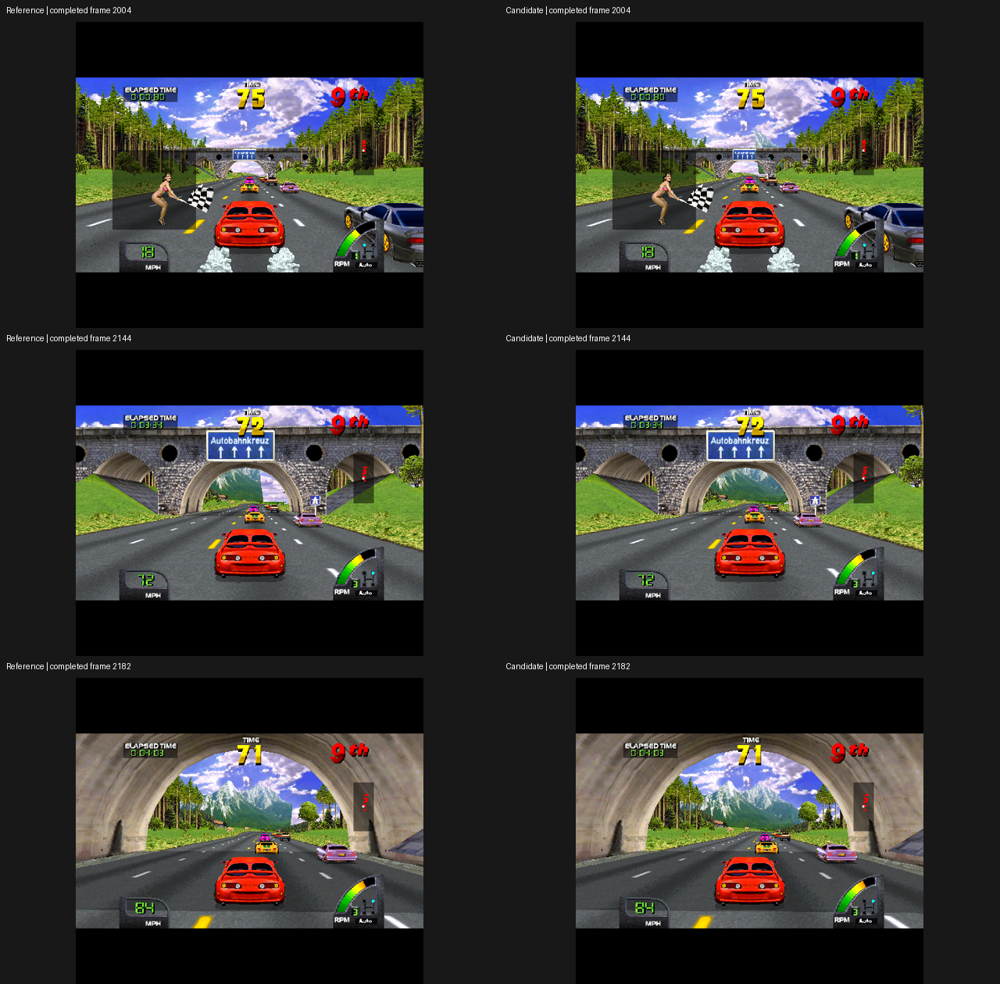

# More mountains, a forest strip, and the activation limit

The World 2.4 Distant Scenery option now covers five verified mountain models,
four small tree variants, and one grouped forest strip. The added mountains are
visible through Germany's first bridge earlier, with their original later shape.
This is a useful local improvement; it does not eliminate pop-in along the track.

Native commit: `abe4b98aa38`. Executable SHA256:
`55578f8a06a81a78391119e4bad29b673b90e7e67ea2d6d29907adec1fe8ee90`.
The option remains OFF by default and revision guarded. Other games and World
2.5 cannot activate it. Existing user settings are preserved.

## Newly covered scenery

| Model | Identified from captured geometry and atlas | Radius | Original first submission |
|---|---|---:|---:|
| CB2314 | Mountain, seven polygons | 19,772 | 2143 |
| CB21A2 | Mountain, two polygons | 12,790 | 2181 |
| CB2375 | Grouped forest strip, three polygons | 10,935 | 2175 |

All three use earlier whole-object admission up to 160,000 while preserving the
original projection clamps. The forest strip has a separate classification and
counter. It follows the Trees setting but never enters the small-tree reciprocal
extension. The nearby castle CB2234 remains outside the allowlist.

The bounded experiment adds 938 polygons across 99 completed page-control runs
between frames 2000 and 2200. It preserves every original polygon and its relative
order. The stricter comparison by frame fails because two unchanged HUD polygons
move from frame 2171 to 2172. Both belong to the same scene in both runs; no polygon
is dropped or altered. This timing difference is retained, not silently ignored.

The native implementation matches the three new models' Lua geometry exactly.
With all existing scenery extensions enabled, its complete-scene comparison adds
2,184 polygons in that interval and still preserves all originals in order.

A bounded live control and candidate each complete 131 GL captures, every two
frames from 1980 through 2240. Ninety images differ; the largest change is 1,214
pixels at 2144, around the mountain seen through the arch. Every captured image
from 2184 through 2240 matches the control. Native screenshots at 2040, 2100 and
2160 differ as expected; input and emulated-time rows agree and neither run errors.

The full 8,783-frame native candidate and its repeat agree on all input/time rows
and 146 native images. Ten parent images differ, which is retained separately.
Driving frames 1800–8780 average 100.0041% and 100.0048% emulation. Callback p99 is
26.47 and 26.19 ms; worst intervals are 42.55 and 37.49 ms. These measurements do
not measure GPU latency or certify physical steering feel.

Both runs count 912 extra mountain admissions, 3,964 tree admissions, 277 forest
admissions and 31,712 extended reciprocal reads; maximum index 8,120 remains below
10,000. The 112-patch export reconstructs the native commit tree exactly. All seven
default-build cross-game checks pass, including their timing gates and Exotica's
21 completed GL images. The 71 Python tests and native scenery unit pass.

The dense native run completes 201 images from 1600 through 2400. Compared with
the first native scenery build (three mountains/one conifer), 143 images change,
with a maximum of 1,234 pixels at 2144. Every sampled image from 2196 through 2400
matches. This includes the four-tree additions as well as the new mountains and
forest strip. Candidate repeatability and default-build coverage remain separate.

## A separate pending-list limit

CCF288 is a distant meadow/wooded hillside, largely hidden by closer trees at this
point in the drive. It first reaches the far test at frame 3019 with depth minus
radius 53,996, already within the original 80,000 limit. Tracking its object slot
shows why a far-limit increase alone cannot draw it sooner:

1. The game assigns its model and texture/palette references at 2991.
2. The object waits on a pending list with flag 0x2000.
3. At 3017, a track-section comparison transfers it to the drawing list and
   changes that flag to 0x1000.
4. Its first attributed polygons arrive at 3019.

The comparison at program PC 0x7B58 checks the object's section against the
player's section plus the value at 0xD58C. The guarded diagnostic intercepts only
this identified object's section read, reducing it by one. The guest then performs
its own list transfer. No link, flag, texture or projection data is written by
the diagnostic. This is a causal experiment, not a product implementation.

It activates at 2999 and draws at 3001: 18 frames earlier, adding 54 polygons.
However, it also changes original polygon order in scene 3019. The geometry
validator correctly fails, although no original polygon is lost or changed.
Forty-one completed GL captures show only nine changed images, at most 22 pixels;
nearby trees obscure most of the hillside. The every-two-frame capture does not
include the odd frame 3019, so it cannot settle that specific ordering concern.

This experiment is **not promoted**. It establishes an additional mechanism to
investigate, but offers little visible benefit in this window and needs broader
ordering/asset-lifetime validation. Earlier activation also persists after the
bounded diagnostic tap closes; stopping the tap does not undo the guest's transfer.

## Better evidence tools

`compare_scenery.py --alignment scene` compares complete nonempty page-control
runs, dropping incomplete edges and retaining their frame ranges. The default
remains strict comparison by frame. Neither mode certifies visible pixels,
presentation timing or route equivalence.

`gl_frames.py --frames FIRST:LAST --every N --details` validates sparse completed
captures and reports changed-pixel counts and bounds. `--contact-sheet IMAGE.png`
shows the first, largest and last changed images. It rejects reused filenames,
missing captures, inconsistent frame fences and dropped renderer messages. An
expected visual change still returns FAIL for pixel identity; the detailed report
separates that result from an incomplete or failed run.

Proof directories: [expanded scenery](../../results/proof/2026-09-06-expanded-scenery/)
and [activation investigation](../../results/proof/2026-09-06-activation/).
All automated runs disable physical FFB. No shaders, force profiles, wheel-toolkit
code, ROM files or user preferences were changed in this batch.
