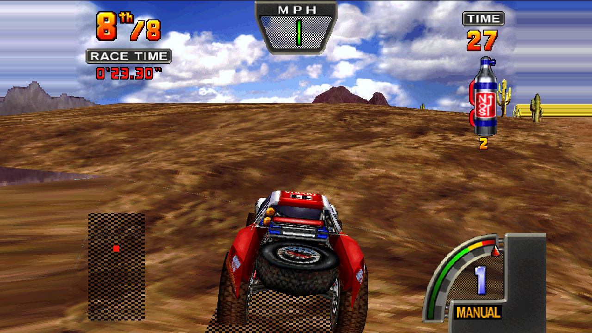
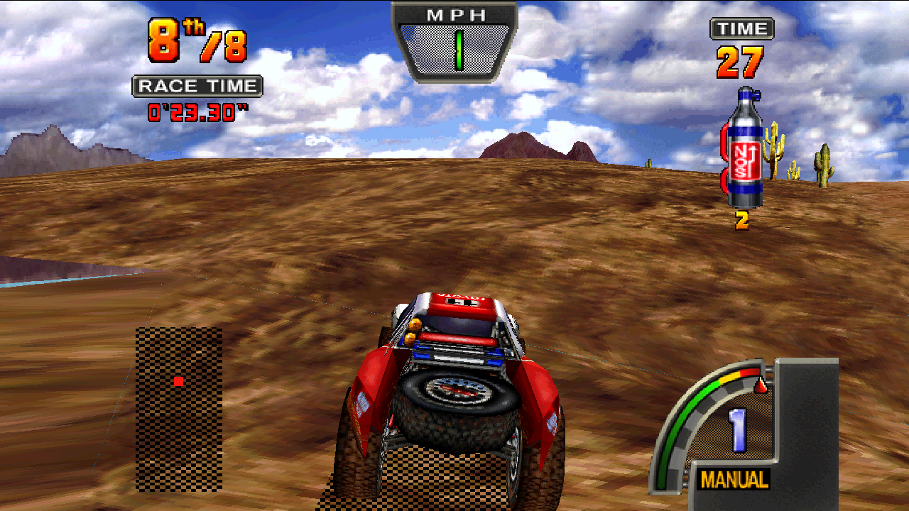
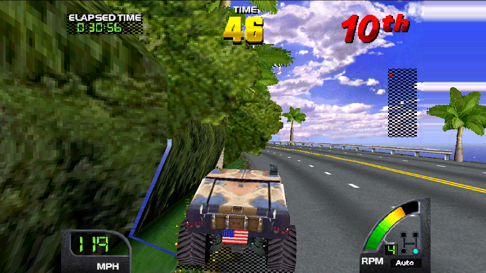
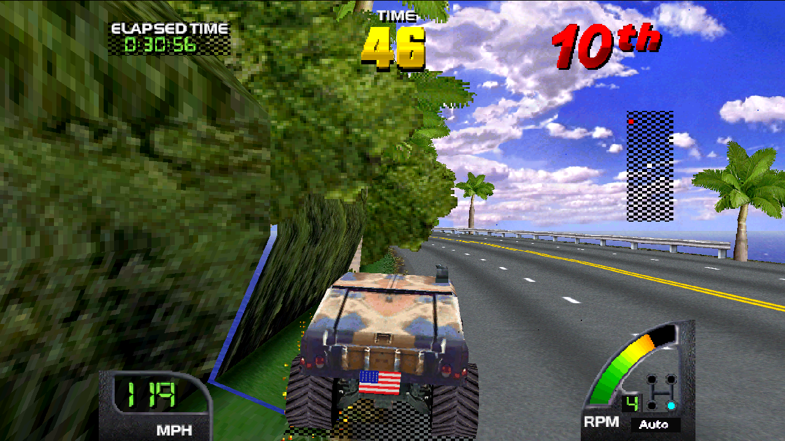
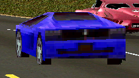
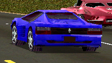

# Graphics, force feedback and reusable contracts

Authorized follow-through on all six recommendations. Starting baseline:
collection `5d61756`, MAME `eb4db8fc706`, toolkit `c9b76b7` / v0.10.1.
Changes remain independently committed. Physical wheel output is disabled in
unattended tests. Existing recordings are immutable.

| Work | Required evidence | Status |
|---|---|---|
| USA visibility execution difference | First differing state/timer evidence; distinguish reproducibility from gameplay equivalence | First differing player writes located; exact cause remains open |
| Ordered live rendering and captures | Resource-write interleaving, queue stalls, complete scene identity, gameplay comparisons | Implemented; repeated GL pixels and lossless stall pass; overflow fails explicitly |
| Remaining seams and sky | Actual defective region with primitive/resource provenance and cause-specific comparison | Valid sky restored by retiring default margin suppression/stretching; thin geometry gaps remain |
| Draw distance | One object's visibility/lifetime decisions during a recorded approach | Actual LOD transition traced and detailed-model experiment demonstrated; far plane unchanged |
| Collision feedback | Labelled event evaluation and bounded explicit impact output, no unattended torque | Opt-in steering pulse, source/stage logs and label evaluator implemented; physical acceptance pending |
| Shared toolkit contracts | Native/managed conformance and versioned consumer adoption | Toolkit 0.11.1 pinned; USA numeric HUD producer replaces OCR where guarded and available |

Shared V-Unit changes require USA, World (supported ROM revisions), and Off Road
checks. Exotica uses Zeus and needs its own rendering controls; common force,
telemetry, launcher and harness changes still require Exotica coverage. Attract
and boot checks are labelled as such and never substitute for gameplay coverage.

## The graphical workaround that was making things worse

The broad margin filler was not repairing missing textures. It deliberately
discarded some full-width backdrop polygons outside the original 4:3 area,
then extended a column of pixels from the native boundary. The material test
used only the texture-base low byte and a width threshold. This erased valid
clouds and produced conspicuous horizontal bands in both World and Off Road.

Controlled gameplay captures at frames 5480–5490 preserve all native inputs,
timestamps and native screenshots with the workaround disabled. Across those
22 GL frames, changes are confined to the margins and narrow edge strip; the
central region (columns 167–1112 in these 1280-pixel images) is pixel-identical.
The restored clouds are the game's submitted polygons and textures.

The product now defaults `MIDV_GL_MARGINFILL` off. Setting it to `1` restores
the legacy experiment. Local crack filling retains its existing default and
radius. It cannot repair a missing polygon, wrong texture coordinates or a
gap whose visible pixel belongs to a background polygon. Its coverage mask
does not establish which surfaces should meet. Widening that filter would
make it easier to smear silhouettes and intentional gaps.

| Legacy margin filler | Restored submitted sky |
|---|---|
|  |  |
|  |  |

Thin terrain gaps and the blue seam beside World's near tree are still visible.
These are retained defects, not evidence that the sky should be suppressed
again. Future fixes should identify the adjoining source polygons and their
clipping/coverage rules. No broader crack-filling shader was added here.

## Render ordering and repeatable evidence

The old live path could hold a scene while newer textures or palettes arrived,
merge work for a page and present before the corresponding native frame was
complete. CPU pixel writes also used a separate underlay rather than updating
the same persistent page as polygons. Those behaviors make a mislabeled
screenshot or a stale texture look like a geometry bug.

The V-Unit consumer now flushes preceding polygons before resource or CPU pixel
writes, applies those writes to the same page, and presents at a frame fence
sent after the final visible screen update. Capture receipts include
`completed_frame`. Interlocked ring publication preserves command visibility;
each in-process renderer has a private process-specific ring. The old global
mapping could let two emulators overwrite each other's stream.

Both renderers now wait for queue space instead of dropping persistent state
changes. A 500 ms producer timeout fails the stream and returns to native
presentation. The harness rejects the fallback. Zeus receives this queue
policy, but does not yet have V-Unit's completed-frame GL image oracle.

Evidence includes 31 consecutive USA GL frames identical across two runs and
after a deliberate 100 ms consumer stall with a 16 MiB queue. An actual
five-second stall during texture loading triggers the explicit failure path.
Eleven World v2.4 gameplay GL frames also match across the renderer changes.
Missing, duplicate, unordered, differently sized or dropped-state captures
cannot pass `harness/gl_frames.py`.

The external `gpu/live_viewer.py` remains a legacy reference and is labeled as
such. Use the in-process renderer for product comparisons. Full-size GL BMP
capture is deliberately short and can itself perturb host presentation time;
the normal recorder's deferred native PNG capture remains the low-overhead path.

## Widescreen changes guest execution: what is and is not established

The three-word USA object-visibility patch still adds margin geometry without
changing matched-state native pixels in the earlier isolated captures. Over
a full run it is not gameplay-equivalent to the original unpatched executable.

New read-only probes establish:

- All 20,001 actual ADC/digital input hardware transactions in the compared
  prefix agree, including frame, program counter and value.
- All 1,921 writes to the update-step word `C95F` agree. A changed timestep
  count is not an explanation supported by this evidence.
- The first timer read difference occurs near frame 750, at the profiling
  reader `4F3B`. Returning the entire baseline sequence of 19,154 timer reads
  in a diagnostic intervention does not restore native image equivalence.
- The first differing player velocity write is at `9680`, into object word
  `10B0A`: frame 3063 unpatched versus 3064 widened. The corresponding position
  addition at `90AB`, word `10AF8`, then differs. Later player/camera state changes.

The extra rendering work crossing a frame boundary is significant evidence,
but the exact upstream state dependency has not been isolated. No timer or
physics compensation was shipped. Preserve both the original recording and
the explicitly derived widescreen case; compare render-only changes against
the same patched starting configuration. A future guest-independent margin
renderer would need to decode and draw culled objects on the host without
changing the game's execution, which is a separate architecture project.

## Distance: a real LOD transition, not a larger unused far plane

The bounded `lua/usa_object_lifecycle.lua` probe records the actual object,
selected/base/alternate model, flags, depth minus radius and far limit when
the CPU reads word `55`. It verifies USA v4.5 instruction signatures first.
The 2900–3800-frame investigation collected 120,193 visits over 468 object
slots and found seven close-in model transitions. No finite depth between
80,000 and 1,000,000 was rejected in this trace; the exceptional large integer
entries should not be mistaken for ordinary distant scenery.

For object `133BD`, the selected model changes from `C28C38` to `C2857A` as
depth crosses 8,000, then changes back when the vehicle moves away. The
medium/far thresholds at instructions `BF` and `C3` are 8,000/15,000. These
are independent of the 80,000-unit final distance gate.

`patch/game/crusnusa-lod-experiment.txt` moves those thresholds to
12,000/22,500 in a checked, explicitly selected experiment. A late application
at frame 3054 changes one traffic car in the captured 3058 scene: 12 simplified
quads are replaced by 60 detailed ones, for 2,417 → 2,465 total scene quads.
Texture and palette RAM agree. The 4× preview changes 13,386 pixels inside
one 188×88 region, corresponding to that car.

| Stock model | Detailed model experiment |
|---|---|
|  |  |

This demonstrates increased detail distance for that model. It does not
extend road residency or prove all scenery can appear farther away. The
experiment is not installed by default; a larger guest workload still needs
route, timing and cross-game validation. Do not copy these ROM addresses to
World, Off Road or Exotica.

## Collision feedback and reusable contracts

The new toolkit `ImpactMixer` provides an explicit 100 ms steering-axis torque
envelope instead of relying on a wheel's interpretation of generic rumble.
It reserves 25% of the constant-force budget and uses a common final strength
for structural force and overlapping impacts. The two lobes have equal areas;
output remains bounded. The bound does not include independently downloaded
spring, friction or damper effects.

It is opt-in through `[collection] ffb_impact=1`, a per-ROM `ffb_impact_<rom>`,
or `MIDV_FFB_IMPACT=1`. Existing profile parameters are unchanged. An attended
recording can retain configured wheel output with `--record-with-ffb`; playback,
synthetic runs and timeout-capable diagnostic execution cannot enable it.

Each new case retains `force-source.csv`: emulated time/frame, raw game motor
byte and the adapted byte after driver gain/clamp/slew. The worker trace
records impact candidates, intended output and whether the constant-force API
accepted the output. Raw adapter telemetry is available with the wheel off.
The enhanced mixer replaces generic rumble for its impact cue, and menu/hold
cancellation clears the envelope. Physical wheel behavior remains untested.

The offline analyzer executes the same native shaper/mixer. `--labels` scores
predictions only inside explicitly reviewed intervals, distinguishes missed
contacts from unmatched candidates, and prevents duplicate hits inflating
recall. PASS means successful computation, not a good subjective tune. The
user recording currently yields four waveform candidates; these are not four
confirmed crashes. The opt-in detector reads raw game force before driver
gain, clamp and slew; structural force retains those adaptations. A checked
artificial trace reduces a full raw pulse to byte 20: the enhanced detector
finds its onset at 100 ms, the legacy path does not, and both stay within the
50% output limit. Both source-trace formats are checked in CI. Actual collision
flags remain a game-specific task.

Toolkit 0.11.1 also supplies native/managed scalar source, unit, quality and
timestamp contracts. Managed wheel selection now honors instance identity,
rejects missing/ambiguous explicit preferences and never interprets a negative
index as automatic selection. VID/PID metadata must actually exist; it cannot
be inferred from a device's instance GUID. Native device ABI behavior and
other consumers were not silently upgraded. The shared source contracts pass
109 managed tests, MSVC/GCC analytical tests and all ten existing profile vectors.

## USA speed: the producer was there

USA v4.5 writes packed decimal text to RAM word `E632` from formatter store
`A7C2`; the HUD text renderer reads it at `7A91` and submits the digit quads
through `AF2A`. Examples include `00393031` → 109 and `00303131` → 110.
Earlier assertions that the displayed speed existed in no memory were too strong.

The new reader accepts only the guarded ROM instructions and the actual
foreground speed digit submissions on the relevant render page. It decodes
at most three digits, validates 0–400 MPH and expires the page sample after
three frames. It defaults on where available, falls back to OCR, and can be
disabled with `MIDV_SPEED_NUMERIC=0`. This is numeric displayed speed, not a
decoded physics velocity vector or an RPM fix.

The full user replay remains identical over 5,012 frames/83 native images.
The numeric source is available for 2,483 samples versus 2,336 OCR samples;
147 OCR misses are recovered. There are 1,732 equal readable values and 604
readable disagreements. Numeric provenance is corroborated by the formatter
and the submitted glyphs, rather than choosing whichever number looks plausible.
`signals.csv` retains actual sample time/frame, source, quality and SI speed.
Displayed samples can be marked held because page presentation follows their
production. No future sample timestamps were observed.

## Coverage and remaining acceptance

USA preserves the original human INP. World v2.4, World v2.5 and Off Road now
have 6,000-frame synthetic cases with 100 native snapshots each. The first
Off Road case entered a race in neutral; it is not counted as driving. The
corrected H-pattern case holds first gear and leaves the start, including
off-road terrain, steering and braking. It is not a skilled lap or a substitute
for a human-driven course library.

Exotica has a 3,600-frame neutral boot/attract case. Headless replay diverges
after frame 1440 despite matching inputs; the recorded throttled presentation
passes, including the rebuilt candidate. Exotica gameplay and exact GL capture
coverage remain open. No physical force was applied to any wheel in these tests.

Next acceptance should focus on labelled wall/car contacts on the actual rig,
more human routes through the residual terrain/near-tree seams, Exotica gameplay,
and model-specific distance/performance probes. None of the evidence certifies
all tracks, all wheel bases or artifact-free widescreen rendering.

Compact reports, failed controls and image crops are tracked in
[`results/proof/2026-09-06-follow-through`](../../results/proof/2026-09-06-follow-through/).
Full immutable cases, raw images, traces and failed experiments remain under
the gitignored `results/diagnostics/six-*` directories.
