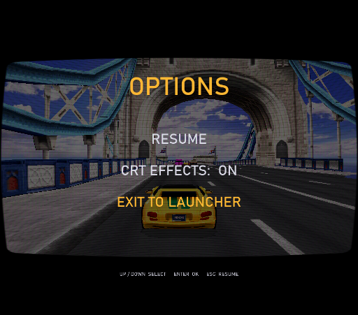
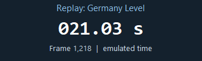
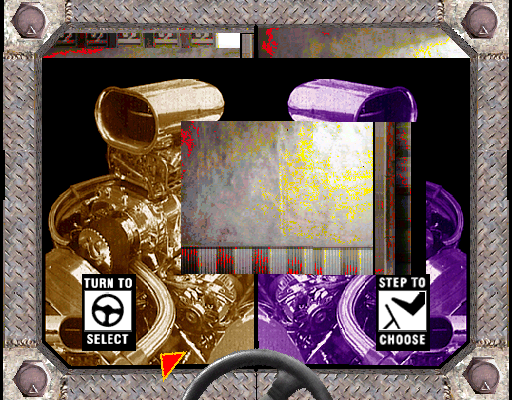
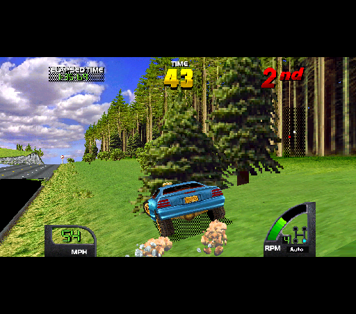

# Germany Level: replay, pause menu and diagnostic clock

The full human Germany race is preserved as **Germany Level** in
`results/diagnostics/world-germany-20260906`. It contains 9,269 frames,
160.00815328 emulated seconds and 154 native snapshots, plus the effective analog
inputs, original executable, initial state and attended FFB traces. It uses World
2.4, scale 4, full widescreen (86-pixel margins), seam alignment and crack fill,
steering sensitivity 90 / curve 120 and force strength 80. This is the seventh
local regression fixture. The case stays local because it includes an emulator
binary and personal rig configuration; the tracked regression list references it.

## Fixed: Esc paused without a visible menu

The completed-frame presentation gate waited for a new game frame before drawing
anything. Esc paused the emulation producer before its next fence, so the menu
handler ran but its UI could not appear. The renderer now presents menu changes
while paused. Ordinary gameplay screenshots still require a completed game frame
and exclude menu redraws.

`harness/check_menu.py` exercises the actual key handler using explicit local
diagnostic edges, with `MIDV_FFB=0`. It does not inject global keyboard input.
The before control fails with missing paused-menu images. USA, World and Off Road
each pass eight captured UI states: opening, navigation, CRT change, resume,
reopening and selecting exit, followed by a clean game exit. The paused completed
frame remains stable and advances after resume. Exotica has a separate menu path
which was not modified. These tests do not substitute for the user's next physical
Esc check from the collection shell.

MAME commit `daed6ea2a19` is built at `E:/Source/mame-src/vunit.exe`, the executable
used by the Stream Deck launch chain. Its SHA256 is
`923206d92188abe773f49a8abb7a5829a366966ea3898109081833307c23ca6c`.
The 106-commit exported series reconstructs tree
`d026555b2c855ed9bf489b07fd8bdc568d1c7e85`. The racing deployment's `mame.exe`
was not changed. F12 remains the emergency MAME quit binding; the attended
recording helper ends when the game closes, whereas the collection normally
returns to its shell. The separate reported whole-launcher F12 behavior has not
been reproduced here.

## External recording and replay clock

`record_drive.py` preserves the collection's actual settings and shows a passive
Windows timer by default. It displays emulated seconds and frame number, starting
at boot and including selection. It stops advancing on pause; replay uses the same
timestamps. It flushes the existing CSV every six frames and polls at 50 ms,
rather than encoding extra screenshots or estimating time from wall-clock speed.
Allow approximately 0.1 seconds of sampling lag when describing a transient.

Use `--no-clock` on recording to disable the panel/extra flushes;
`--clock-position X:Y` positions it, including on another monitor. Replay opts in
with `--clock`. Old recordings keep their original archived Lua script; clocked
replay explicitly copies and fingerprints the current diagnostic script in its
new output directory. No original case evidence is rewritten.

The visible clock replay passed all 8,240 prefix inputs/timestamps and 137 native
snapshots, and retained all 1,141 completed GL frames from 7,080 through 8,220 with
zero dropped messages. Its final timer sample was frame 8,240 / 142.24481422 s.
The panel was visually inspected and remained separate from the game captures.
The first dense capture attempt stopped at 8,220 and correctly **failed** because
the consumer had only presented through 8,219. The successful run left a 20-frame
exit buffer; the failed evidence is retained as such. Full graphics performance
with the timer on every wheel/monitor configuration remains unmeasured.

## What the gameplay evidence establishes

| Target | Finding | Next useful experiment |
|---|---|---|
| Automatic D/A transition, frame 1,320 / 22.79 s | Corruption exists in the native image as well as GL. A control restoring all original World program words matches the same bad native image. | Dense transition snapshots and texture/DMA lifetime traces; compare an unmodified upstream renderer/build before attributing it to MAME or the original game. |
| Black left road margin, frame 7,280 / 125.67 s | Dense gameplay replay isolates a black triangle while driving off-road. In the captured state, the inspected point has no current owner and no submitted polygon even bounds it. | Trace World-specific polygon visibility/clipping, using this geometry hole as the target. |
| Distant mountain/landmark pop-in | Still visible. No new World distance improvement has been established. | Find World-specific object/LOD admission tests and capture state just before/after a landmark appears. Count newly admitted **visible** pixels, then measure timing and other tracks. |

`germany-black-7280-state` is a passing 7,282-frame prefix with six completed GL
images and a frame-7,280 quad/VRAM/texture/palette dump. Offline quality rendering
reproduces the margin hole with **zero eligible T-junction corrections**. At
buffer (100,1100), native coordinates (-61,275), coverage is false, index zero,
owner 65535; none of the 756 current-scene quad bounding boxes includes it.
This establishes absent submitted geometry at that point, rather than a black
texture fetch or a gap between nearly adjoining raster edges.

A late diagnostic bypass of the two already-widened big-polygon left-reject
calls (0x387 and 0x3C9, changed at frame 7,276) does **not** recover it. Both
instruction guards and final effective RAM checks pass; inputs/native images
remain identical, all 756 current-scene quads are unchanged, and quality pixels
change by zero. The geometry-extension acceptance correctly fails for zero new
geometry. Thus simply loosening those existing left bounds is not the fix at
this state; trace earlier admission or a different polygon path. The bypass is
retained only as a diagnostic, not installed in the launcher patches.

The new state's separate native-exact check found **99.9990%**, with two differing
pixels out of 204,800 at (7,250) and (77,297), owned by quads 488 and 562. This is
a newly exposed failure, retained without relaxing the zero-mismatch threshold.
It does not affect the existing `capture-8000` **100.0000%** result and is distinct
from the large margin hole. Native edge/UV rounding at those vertices needs its
own follow-up before this new state can become an exact-renderer fixture.

The archived executable reproduces the entire 9,269-frame drive exactly, including
all 154 native snapshots. The new menu executable does too. Its full live replay
also retained 135 completed GL captures; these document enhanced rendering, but
the original recording has no GL image reference to compare against. Native
identity is not proof of correct widescreen margins.

Do not increase crack-fill radius or restore broad Margin Fill to conceal these
defects. The D/A problem survives disabling the widened program, and the black
triangle is much larger than a raster seam. A renderer-wide texture fill would
hide the evidence and risks restoring the already observed smeared skies. World
requires its own guarded distance addresses; USA's previous far-plane experiment
added 97 quads but zero visible pixels at the measured state. Optional depth-aware
haze or fades could soften eventual object transitions, but require reliable
depth/ownership data and are not implemented or validated here.

## Force feedback evidence

The attended recording did retain FFB: the Moza R12 was selected at strength 80,
profile `cruisn-vunit@2`, smoothing 20 ms, impulse bypass 0.60. All 7,358 constant
force API requests were accepted, with no rejection, and peak shaped output was
0.800012 of the signed SDL range. There were 27 impact candidates and generic
rumble requests. The optional steering-axis impact enhancement was set to zero.
API acceptance is not a measurement of physical torque or perceptual crash feel.

During the race, 7,468 raw samples span -126 to +126; the driver did not change any
of those samples. 8.9181% of samples hit either raw limit (sample-count based,
not time-weighted). Large motor changes near frames 4,013, 5,942, 7,143 and 8,099
are useful investigation anchors, not ground-truth collision labels. The offline
toolkit shaper simulation finds 29 candidates rather than the live worker's 27;
its fixed 4 ms schedule differs from the real worker's wall-time scheduling.

To improve crash distinction, label actual contact/onset frames visually first,
then compare raw motor, smoothed output, impact envelope and wheel motion over
those windows. Establish whether the game's signal contains a distinct impulse,
whether smoothing suppresses it, or whether the supplemental cue is needed.
Turning up global strength is not supported by this trace. No FFB polarity,
gain, profile or physical output was changed in the automated experiments.

The recording's average reported speed includes a 7.43-second host callback gap
at frame 9,201, consistent with the user's Esc pause. Do not interpret that
whole-run average as a rendering slowdown. Timing comparisons must select actual
driving/selection intervals and exclude deliberate pauses and dense captures.

## Retained checks

Compact machine-readable results and proof images are under
`results/proof/2026-09-06-germany-level/`. Large immutable inputs, native/GL images,
force logs, failed controls and candidate runs remain in `results/diagnostics/`.
The existing `capture-8000` exact renderer check remains **100.0000%**. The menu
change does not modify shader code, World clipping constants or other games'
program patches. See [record/replay instructions](../DIAGNOSTIC-REPLAY.md) for use.
