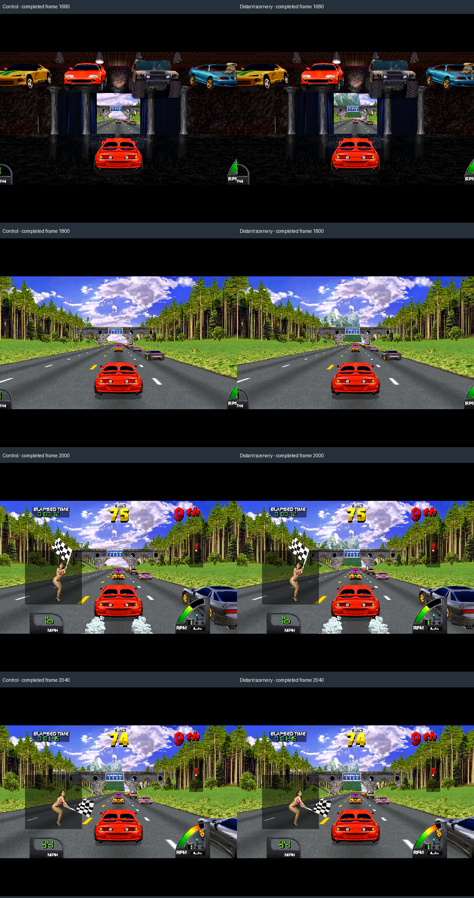

# Native distant scenery: measured World 2.4 candidate

The first native distance candidate brings Germany's mountain above the first
bridge into view during the garage exit and starting sequence. It preserves the
mountain's later appearance. This is a limited scenery extension, not an unlimited
draw-distance fix. Physical driving acceptance and broader level coverage remain.

## What changed

`native/world_scenery.h` owns a small, guarded World 2.4 policy. Native commit
`3dc426ec75d` installs opt-in read handlers in the game driver; it never writes
the far word, reciprocal table, model data or instructions. The executable is
SHA256 `075d16a7cc7648b3dd61b19fd2fda264cc476ebf48584c76256847371ddc5ffb`.

| Model | Identification | Policy |
|---|---|---|
| CB15F8 / CB171E / CB1A8B | Three textured Germany mountain models; radii33292/31514/26031 | Admit up to160000, preserve original far-clamped perspective |
| CA57F3 | Conifer tree card; radius1950, object flags1008 with optional high state bit | Admit only originally rejected instances, project through a bounded virtual reciprocal extension |

Original-range objects retain their original path. Newly admitted trees must fit
wholly within the extended projection range: depth-minus-radius ≤160000−2×radius−16.
Their whole-object test and fast-path decision change together. Lookup indices
5000..10000 are supplied only at verified fast projection PCs for the active tree.
Original lookup entries and the mountains' clamp instructions remain unchanged.
Unexpected extension overflow requests clean exit and cancels physical force.
Active tree context participates in save states; reset clears it.

ROM name, original far value, reciprocal base, projection instructions, model,
flags and exact radius are checked. Other revisions/games cannot activate this
policy. It is compatible with the current conservative World Widescreen Terrain
patch. Arbitrary projection patches can fail its guards and are not supported.

The launcher exposes **Display → Graphics Experiments → World → Distant Scenery**,
default OFF. It requires World2.4, widescreen and scale>1. The family preference is
preserved when selecting World2.5, but the menu and launch path disable it there.
Developer `MIDV_SCENERY=mountains|trees|all|off` selects independent controls;
`MIDV_SCENERY_LOG=1` writes per-frame admission/projection counts to `scenery.csv`.

## Evidence

- Read-only provenance and the final Lua tree experiment differ by exactly42
  added CA57F3 quads over21 drawing frames1999..2039. No original quad changes,
  disappears or changes relative order. The native tree path matches that Lua
  geometry exactly. Object14118 projects to X368..373/Y197..206 at1999.
- The complete8783-frame Germany candidate and its repeat match all input/time
  rows and146 native snapshots. The parent comparison retains six changed native
  images1680/1740/1800/1860/1920/1980; later sampled images are identical.
- Both candidate runs average100.005% emulation over1800..8780. Their callback
  p99/worst values are recorded in proof JSON; these are not GPU presentation
  latency or a promise of no stutter.
- Each run records371 additional mountain admissions,660 tree admissions and5280
  virtual reciprocal reads; maximum index7361, below the supported10000. Admission
  is not proof of a visible contribution; other geometry can obscure an object.
- Dense live GL controls retain201 completed frames1600..2400 every4. There are
  103 changed images1620..2028. **All93 images2032..2400 are identical.** Earlier
  mountain pixels are visible through the garage exit, then above the bridge.
  The conifer-only test does not establish a noticeable forest improvement.



The candidate's native screenshot mismatches against its parent are expected
and retained. The derived-case identity pass certifies repeatability, not original
route equivalence or attended acceptance. Later screenshot agreement is encouraging;
camera/ADC traces provide a separate finer route check when needed.

## Harness improvements and rejected experiments

`compare_scenery.py` compares attributed DMA traces by frame, including duplicate
polygons and original relative order. Allowed new model IDs must be explicit.
Unknown additions, changed originals, missing frames or malformed rows fail.
An optional per-new-quad extent bound catches giant projected trees. Geometry
success must still be paired with completed GL images and motion/timing evidence.

The first tree probe confused DMA material flags900 with object flags1008 and
made no changes; it is not treated as evidence of an improvement. The next version
read selected-model RAM from inside a tap covering that same RAM. Re-entrant reads
corrupted its returned projection values and generated giant polygons. Its evidence
is retained and the new extent gate rejects it. The final Lua avoids nested reads;
the native handler reads backing RAM directly. The bounded Lua probe now requires
actual extension reads before reporting completion.

```powershell
python harness/replay.py CASE --candidate E:/Source/mame-src/vunit.exe --scenery all
python harness/derive_case.py CASE --candidate E:/Source/mame-src/vunit.exe --patch CASE/initial/game-patch.txt --scenery all --output NEW --title "Germany scenery"
python harness/compare_scenery.py CONTROL/scenery-draws.csv CANDIDATE/scenery-draws.csv --allow-added-model ca57f3 --max-added-extent 32 --report tree-geometry.json
```

All automated runs disable physical FFB. Full evidence lives under local
`results/diagnostics/scenery-*` and `germany-scenery-native`. Compact comparisons,
screenshots, repeatability, timing and the110-patch export reconstruction are in
`results/proof/2026-09-06-native-scenery/`. Shaders/toolkit/force settings are unchanged.

All seven original default-build local cases pass, including configured timing
windows and Exotica's21 completed GL images. The67 Python tests, native scenery
unit and20 GPU quality fixtures pass. CI34067459020 at96ea041 passed all four jobs.
Default-build coverage is separate from the new Germany candidate's repeatability.

## Next coverage

CA5833 is the mirrored conifer; CA5863 and CA5896 are broadleaf cards, verified
against the captured atlas. They account for many more far-gate visits than the
initial CA57F3 model. Their measured original admission crossings include
frames2031..2193, so they are the next bounded geometry/GL experiment. They are
not included in native commit3dc426ec75d.

Increasing every distance number would also change mountain perspective, other
objects' projection safety and the amount of guest drawing work. It cannot by
itself make a track section that has not loaded become available. Continue with
identified scenery classes, then investigate loading boundaries and deliberate
distant transitions. The goal remains no noticeable pop-in; this candidate only
addresses a measured subset.
