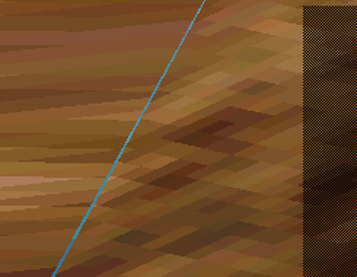
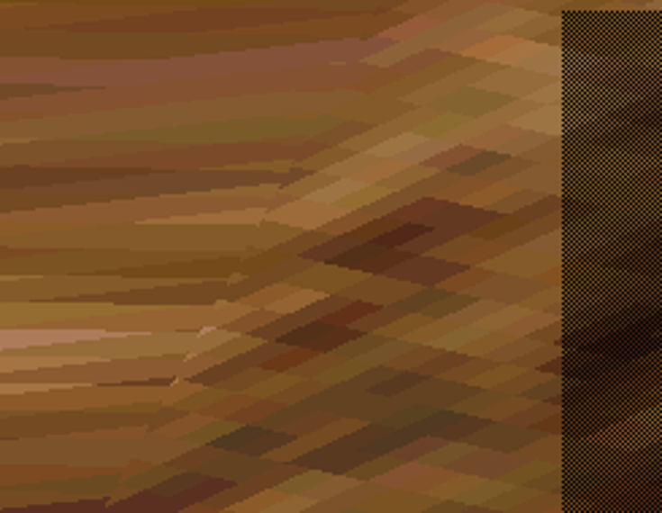
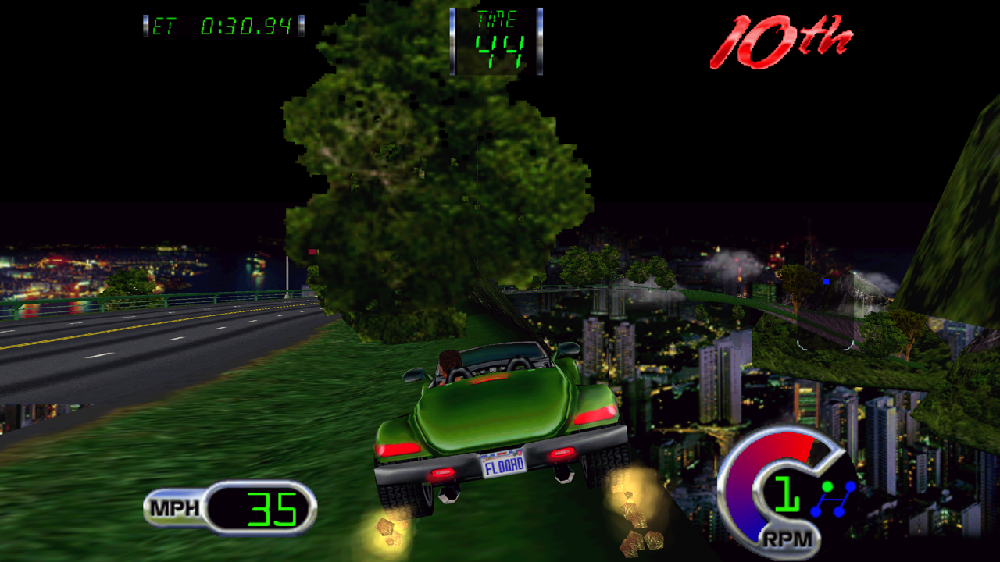

# Rendering seams, visible-frame testing and distance reassessment

This follows the [six-part implementation review](2026-09-06-follow-through.md).
Original human recordings and failed controls remain immutable. All unattended
runs disable physical force and external telemetry. The deployed racing MAME
executable was not modified.

## Thin geometry was discarded at high resolution

The quality fragment shader used two native integer coverage rejection tests
before its continuous high-resolution coverage test. A narrow triangle can
cover fine samples even when its rounded native scanline span is empty. The
integer test discarded those valid samples. The same problem affected a
subpixel-height primitive's vertical extent.

Those rejection tests now apply only at native scale. Enhanced rendering uses
continuous coverage in both dimensions. Texture-domain clamping and native DDA
remain intact. A targeted thin-triangle fixture fails before the correction and
passes afterward. Both archived USA native captures remain **100.0000%** exact.
The GPU fixture suite now includes this case and geometry-join coverage at 2×/4×.
On captured gameplay this changes 1,141 polygon-owner samples in Off Road and
181 in World v2.5. Total coverage does not increase there because sky/background
already occupies the affected pixels; previously missing fine geometry replaces it.

This preserves thin geometry already submitted by the game. It does not create
objects that the game culled or increase the guest's far plane.

## One Off Road blue seam has a geometric cause

In the driving capture at frame 5518, pixel (291,1108) at 4× resolution belongs
to the sky polygon, not an invalid terrain texel. Adjacent terrain polygons
125–127 form a closed T junction with matching material and UV coordinates.
The shared vertex (-41,326) lies 0.678435 native pixels away from the long edge
between (22,212) and (-103,441). Integer vertex quantization leaves a wedge
through which the sky remains visible.

The experimental correction projects that shared vertex onto the long edge at
(-40.404504,326.325052). This fills the wedge with the actual terrain texture.
It is separate from the palette-pass crack filler. The initial offline control
reduces blue pixels in the restricted lower-left seam region from 1,305 to one.
The live experiment also changes the adjoining triangles' texture interpolation;
it must not be described as changing only the crack pixels.

With the thin-span correction included, the tested seam region has 634 blue
samples before alignment and zero afterward (RGB: B>160, R<60, G<160). The tracked
crops show the actual texture continuing across the former sky wedge:

| Before alignment | Opt-in alignment |
|---|---|
|  |  |

The implementation requires a closed chain across three different opaque
textured polygons, matching material and XY/UV identities, a subpixel displacement,
and consistent UV interpolation. Conflicting adjustments and moving anchors are
rejected. Python and C++ implementations share 12 checked conformance cases.
The native 1× path never uses this correction.

Use `MIDV_GL_TJUNCTIONS=1`, `replay.py --align-tjunctions`, or offline
`renderer.py --align-tjunctions` to test it. It remains **off by default**.
One World capture has no eligible joins and is unchanged by this experiment.
Large missing terrain margins and World's near-tree seams remain separate issues.
The local crack fill radius/default is unchanged; widening it would conceal the
cause while risking new smearing.

`harness/inspect_pixel.py` now reports the polygon owner, neighboring DMA records,
texture base, palette, original vertices and quality vertices from saved buffers.
This makes a suspected bad pixel attributable to a draw, transparency, or missing
coverage rather than guessing from its color.

## Exotica's previous visual oracle was incomplete

The live Zeus renderer intentionally skips CPU polygon rasterization for speed.
After boot, the native framebuffer in the old Exotica GL recordings was black.
Matching those native screenshots proved input replay, but could not certify the
image displayed by the GL overlay. The prior headless-versus-live mismatch after
frame 1440 is therefore not evidence of nondeterministic gameplay: the headless
control actually rendered CPU polygons while the live recording skipped them.

Zeus now sends completed visible-frame fences, presents one completed frame at a
time, and writes the same capture receipt format used by V-Unit. Replay can
require exact GL image equality with `--compare-gl`. Missing, duplicate, unordered,
or dropped-stream frames fail validation. The local multi-game runner rejects a
uniform last visual reference so another black-buffer case cannot certify a race.

A new 6,000-frame Exotica scenario uses the correct pedal/steering/serial port
layout and preserves the first refresh's attosecond rounding. Its completed GL
frames 5400–5420 visibly show driving in a night-city race, including off-road
terrain. A rebuilt candidate replay matched all 21 images exactly. This is replay
determinism of the GL path, not proof that Zeus GL equals MAME's CPU renderer.

The first automatic replay exited abruptly at frame 4125 with code `0x6E76003B`,
without a diagnostic stack or a corresponding application-fault event found.
Its partial trace and failed report are retained. A subsequent complete replay
passed. The cause remains unexplained; it must not be quietly counted as a pass.

`--zeus-native` enables diagnostic double rasterization. A stopped GL consumer
also restores CPU polygon rasterization, which the old fallback did not do.
`--zeus-stop-frame` supplies a bounded diagnostic fault for testing that path.
The double-rasterized control produced real native race images and matched all
21 GL reference images; its 77 native-image mismatches against the old black
frames are expected. Injecting a consumer stop at frame 5500 produced a clean
6,000-frame process exit and a nonblank native race image afterward. The replay
correctly failed on the renderer fallback instead of silently certifying it.
This tests a consumer exit, not every possible queue-overflow condition.

## Telemetry correction

USA RAM word E632 contains packed decimal speed text. The old RPM mapping reused
its low bits and fabricated engine RPM from them. That mapping is removed.
JSON now reports RPM unavailable; all three Forza RPM fields remain zero because
that packet has no per-signal validity field. The actual loopback test received
5,012 JSON status samples and 5,012 Forza packets with no fabricated RPM fields
and valid nonzero speed. The original human replay still matches.

## Distance and guest-state dependency

The earlier 120,193-sample object trace has zero samples between the 80,000-unit
far gate and a proposed 160,000-unit gate. Its 450 larger values all belong to
one extreme-coordinate object and still exceed the proposed limit. Doubling
the far plane cannot admit normal scenery that never reaches this interval.
This implicates earlier visibility/residency decisions, but does not identify
the section streamer as the proven cause.

Extending the probe through the full widescreen drive changes that conclusion's
scope: 293,609 samples across 1,060 rendering frames/500 object addresses contain
15 potential admissions across nine objects, at frames 4293–4589. The largest
ordinary tested depth is 81,035. Thus the far plane does affect a small portion of
this route; it does not alone provide scenery out to 160,000 units.

Applying only the far-plane change at frame 4340, after identical prehistory,
adds 97 quads in the completed frame captured at 4346. All 2,121 original quads
remain unchanged and in order; 89 additions intersect native X coordinates.
The margin-only extension validator consequently reports FAIL, correctly: this
is not solely off-screen geometry. The ordinary native replay still passes.
The 4× rendered images are also identical: the extra primitives do not improve
visible pixels in this capture. More submitted polygons is insufficient evidence
of a useful visual distance increase.
`patch/game/crusnusa-farplane-experiment.txt` keeps this one-word experiment
separate from LOD and out of launcher defaults.

The known 8,000/15,000-unit model switches are a separate opportunity. The
guarded 12,000/22,500 experiment remains available, without a launcher default.
Applied at frame 2800 for the remainder of the human drive, it increases DMA
workload from 2,448,551 to 2,577,168 quads (**5.2528%**) while retaining approximately
100% emulation speed over frames 2800–4980. All recorded input/time samples match;
37 native snapshots intentionally change. This is a performance feasibility
result for this route, not a claim that later guest physics stays identical or
that every game's detail levels can use USA's addresses.
`harness/analyze_distance.py` counts potential far-gate admissions separately
from model transitions and retains the source trace hash.

The USA widescreen patch still changes later guest state despite identical
hardware input reads and timestep writes. The earliest velocity difference now
traces through a copied orientation matrix, back to matrix multiplication at
96D8 using the player's orientation region near 10AFB. Its output first differs
at frame 3063 in stock versus 3064 in widescreen. The velocity input vector
differs later. The original cause upstream of this matrix remains unresolved.
No timer or physics compensation is shipped. Use late patches and matched
prehistory for causal distance experiments.

## Regression coverage

`harness/run_regressions.py` runs the local cases serially: original USA input,
widescreen USA, World v2.4, World v2.5, Off Road and Exotica. It retains each
result, candidate/suite hashes, explicit visual coverage, and named timing
windows. Missing fixtures fail rather than silently reducing coverage.
Callbacks are timed outside dense GL captures; these timings do not measure
GPU present latency or physical wheel response.

The suite is local because it uses owned ROMs and immutable drive recordings.
ROM-free harness, GPU and native conformance tests run in CI. Cross-game passes
cover these routes and frame windows, not every track, renderer condition or wheel.

The full suite passed all six cases: both USA cases retain 5,012 inputs/83 native
images, and World v2.4/v2.5 and Off Road each retain 6,000/100. Exotica retains
6,000 inputs and 21 actual GL images. Measured callback ratios were 99.9982% for
USA selection, 99.9984% for USA racing, 99.9734% for World v2.4, 99.9992% for
World v2.5, 99.9994% for Off Road and 100.0047% for Exotica racing. These local
windows pass the explicit 95% floor. Dense captures are excluded from timing.
The 43 harness tests and 12 native/Python join cases pass locally.

Compact evidence is in `results/proof/2026-09-06-seams-distance/`; full runs are
retained in `results/diagnostics/next-*`.

The final executable, including the diagnostic stop control, also passes
`next-final-exotica`: 6,000 inputs, all 21 completed GL frames and the timing gate.
