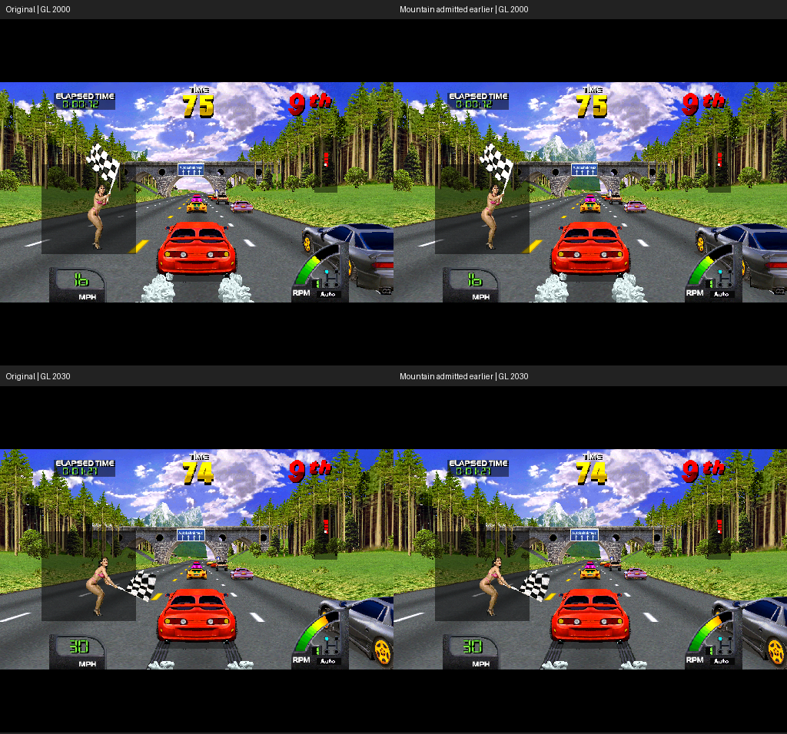

# Selective scenery: the next draw-distance step

The next approach is to extend identified scenery separately from traffic and
road geometry. A bounded Germany experiment now demonstrates one useful result:
the mountain behind the first bridge is present earlier, retains its original
shape, and adds only 15 polygons per draw frame. This is a diagnostic prototype;
no additional distance option or native implementation has been deployed.

## Mountain attribution and measured result

The new read-only `lua/world_scenery_provenance.lua` joins World 2.4 object
admission to actual submitted polygons. IDs must have reached the far gate in
the current frame; unassociated HUD/other submissions remain explicitly unmatched.
It handles the verified slow polygon path's saved object pointer at PC333.
The 1998..2040 trace has 36,395 matched and 1,158 unmatched submissions.
Its replay prefix passes all 2,042 input/time rows and 34 native snapshots.

Object13E40/modelCB1A8B is the textured mountain visible above the first Germany
bridge. Isolated rendering confirms its mountain artwork. At frame2025 it is
still rejected; at2027 its depth-minus-radius crosses from80019 to79839 and it
submits15 polygons, spanning native X167..274/Y95..198. That is already a large
107x103 polygon bounding box when it appears. It does not change model at this
event, so this specific pop is not an LOD transition.

The global100k projection experiment admits this object earlier but changes its
bounds to X184..271/Y116..198. It also changes already-visible mountains. This
explains why a nominally farther draw distance can show smaller mountain peaks,
some hidden behind the bridge. It should not be judged only by submission count.

`lua/world_scenery_admission.lua` tests a different aesthetic: preserve the game's
existing projection, but extend only selected models' whole-object admission.
The prototype overrides the far read at PCA1 for modelCB1A8B, leaving the A8/A9
fast-path safety decision and all reciprocal clamps intact. No guest RAM is
written. This still changes execution by drawing extra geometry; it is not a
pure display-only change. It deliberately preserves far-clamped perspective,
not an accurate-perspective expansion for every kind of object.

The live experiment runs1800..2200 with a160k admission limit. Compared completed
GL frames2000..2200, every2frames, show the mountain already present at the start
line. Differences before2030 are confined to its image region. **All86 images
from2030 through2200 are identical** to the original distance control. Emulation
speed1952..2200 is100.03%. These are measurements of one instrumented interval,
not a full-route performance or handling guarantee.



A second, late matched-state provenance experiment starts1998. It adds exactly
15 CB1A8B polygons on each draw frame1999..2025, removes/changes zero original
submissions, and has no submission differences2027..2039. Its native screenshot
comparison happens to pass because the scheduled images fall before the mutation
or after the original mountain appears; the polygon trace is necessary evidence
of what changed between those images. The longer live experiment correctly fails
strict identity on the three sampled images1860/1920/1980. Inputs/time match.

The local pop at the original cutoff is addressed by having the mountain there
earlier. The test does not prove it never pops at an earlier admission boundary,
nor that all mountains on Germany behave identically. Inspect the complete race
start and later viewpoints before promoting it.

## Trees are a distinct case

The trace identifies modelCA57F3 as a tree billboard. Its texture uses base11066,
palette18176, U3..83/V0..88 in the observed frame; extraction confirms the tree
artwork. Object14118 is already resident at frame1999, depth-minus-radius99830.
The100k projection experiment draws it at about5x11 native pixels. The same model
also occurs on many closer roadside objects, so globally changing that model's
appearance or fading all instances would be wrong.

For trees, test earlier admission with valid projection **only beyond the existing
range**, keeping closer objects unchanged. Then measure the first visible tree
size, gaps in the forest silhouette, and frame pacing. Tree cards need correct
transparency and ordering. A gradual distant fade is a later option if visible
switches remain; it needs object/depth metadata and must not recreate checkerboard
shadows or the retired smeared margin fill. No tree distance fix is claimed here.

## Implementation order and acceptance

1. **Expand the scenery evidence.** Identify Germany's other prominent mountain
   models and tree groups from several pop events. Track first admission, first
   submitted polygons, model transitions and actual completed GL visibility.
   Distinguish objects already resident from those absent until a track section
   is loaded. A host renderer cannot draw an absent asset without another source.
2. **Build a small native scenery candidate.** Port the verified admission rule
   with revision/model guards and original projection safety preserved. Separate
   mountain continuity from correct-perspective tree extension. Add a reversible
   per-game option only after whole-route repeats and timing checks. Avoid extra
   distance work for cars, shadows and road geometry unless evidence calls for it.
3. **Test movement as the acceptance criterion.** Keep tagged pop events with
   surrounding completed frames, first visible pixel area, silhouette changes,
   draw counts and timing. Preserve original submissions within the normal range.
   Repeat each candidate against itself, including the old54s divergence area,
   and keep parent comparisons as diagnostics. More polygons alone is not success.
4. **Handle remaining transitions.** If correct extended geometry still arrives
   abruptly, test a gradual distant transition or a stable background representation
   for mountains. This requires actual model/camera data, not reusing old screen
   pixels. Preserve clear sky and terrain edges and inspect both travel directions.
5. **Carry the method across games.** Share provenance/metrics and native helpers;
   verify each ROM's model layout, projection, bounds and textures independently.
   World2.4 addresses must not be copied into USA, Off Road or Zeus/Exotica.

The existing Germany recording is sufficient for these investigations. A new
attended recording is useful after a candidate improves the moving result and
its extra drawing changes the game route; it is not needed to continue attribution.

## Reproduce and retained evidence

```powershell
python harness/replay.py results/diagnostics/world-germany-extended-20260906 --headless --until-frame 2042 --probe-script lua/world_scenery_provenance.lua --capture-state
python harness/replay.py results/diagnostics/world-germany-extended-20260906 --small-window --gl-capture 2000:2200 --gl-every 2 --gl-max 102 --until-frame 2204 --probe-script lua/world_scenery_admission.lua
```

All automated runs disable physical FFB. Provenance defaults1998..2040, maximum
240-frame span. Admission defaults1800..2200/modelCB1A8B/limit160000 and validates
explicit `CRUISN_SCENERY_FIRST`, `LAST`, `MODELS` (comma-separated hex) and `LIMIT`.
Admission model choices are diagnostic inputs, not a vetted catalogue.
Combined probes are baked into the archived replay script; its hash is recorded.

Proof: `results/proof/2026-09-06-selective-scenery/`. Full CSV/captures and composed
scripts remain under `results/diagnostics/scenery-*`. The isolated mountain image
uses the captured2040 atlas to identify earlier polygons, not to claim exact
earlier-frame texture contents. Actual GL comparisons use the live textures.
The native executable, shaders, toolkit, force settings and product distance
defaults remain unchanged.
