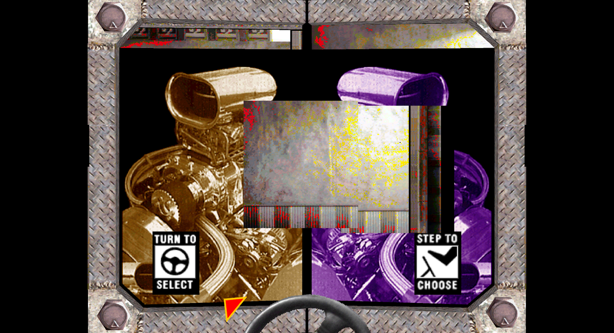
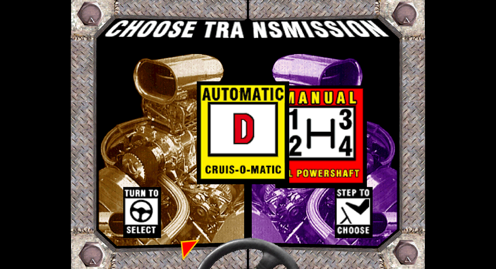
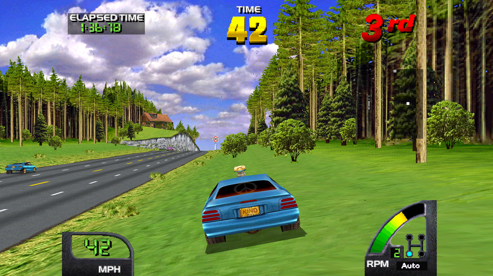

# World transmission assets and Germany road visibility

This follows the [rendering and replay review](2026-09-06-world-rendering-and-replay.md).
The transmission artwork now has an enhanced-display fix. The reported black
road wedge has a conservative visibility candidate, exposed separately in the
launcher so it can be evaluated with a new attended recording.

## Acceptance: improve the game, preserve the evidence

The user clarified that a better driving experience can justify extra drawing
work and a new recording. Exact agreement with the old driving route is therefore
a diagnostic comparison, not an absolute release criterion for intentional
rendering changes. Keep the original Germany recording immutable, retain its
differences, and require a candidate to repeat consistently and perform well.
A new human drive is needed to assess handling and supply useful regression
coverage of the improved build. Replaying the old steering into walls on a changed
route does not by itself establish how the new build handles live steering.

Derived cases explicitly prove candidate repeatability only. They must never be
described as equivalent to the old human drive or substituted for an attended
acceptance recording. The exact dependency between extra guest drawing work and
World route state remains an investigation item.

## Transmission: retain the actual outgoing resource

World 2.4 begins loading a level over textures still used by its outgoing
transmission models. Loader PCs B25/B27 overwrite the D/A region while those
models are still submitted. The job starts from compressed ROM source CD828E,
destination BCA280, returning through the main loop at 5576. This is an actual
asset job, not a missing texture caused by widescreen rasterization.

Read-only probes `lua/world_asset_jobs.lua` and `lua/world_ui_models.lua` identify
the owners: models FD70C1/FD763C for the panels and FD76B3/FD778C for the header.
The instruction at 6F identifies the UI list root at 61ED. It points to a list
header before the first object; object word 13 is its model pointer. Panels are
submitted through frame 1358 and the header through 1376 in this recording.

A texture-only causal control defers writes to byte range 393000..3C0FFF while
those models remain linked, releasing 30,080 overwritten words at frame 1379.
Both the panels and header recover. Palette retention is unnecessary. This
control is diagnostic only: the product does not defer writes into game memory.

The product instead captures the outgoing atlas before the first overwrite and
substitutes those retained bytes into ordered GL texture uploads until the models
leave the list. Guest RAM, DMA, native rendering and emulation timing remain
unchanged. Only the affected region is retained; other texture writes remain live.
Reset and state load discard retained resources. No behavior depends on recorded
frame numbers. World 2.4 instruction/model guards, active GL, and internal scale
greater than one restrict the fix. World 2.5, other games and native exact rendering
are outside its scope. `MIDV_GL_UI_ASSETS=0` or replay `--no-ui-assets` disables it.

All 21 completed GL images through frames 1200..1400 match the semantic causal
control exactly. An on/off comparison changes only sampled frames 1280..1370;
images before and after the asset lifetime agree. The full original Germany
replay passes all 9,269 input/time samples and 154 native images. Its 7,401 camera
samples and 22,203 actual ADC reads, including exact read times, also match.

The first GL verification ended at its final requested capture frame and missed
that image during shutdown. It is retained as a failed, incomplete capture.
The final run leaves ample time after the image window. The guest-memory causal
control intentionally fails native pixel comparison at 1320; its independent
21-frame GL comparison is the relevant proof, not a relabeled native pass.

## Road: a projected object bound rejects visible terrain

Completed GL frame 7340 shows game ELAPSED 1:36.78. Offline dump 7338, rather than
7340, matches that scene. At native position (-82,355), the original enhanced
buffer has palette index zero and no owning polygon. It is an actual geometry
hole, not a texture returning black. Neighboring road polygons end around it.

Matched late controls narrow the cause:

| Control | Added current-scene polygons | Restores the sampled wedge |
|---|---:|---|
| Previous bounded horizontal extension | 50 | No |
| Bypass large-polygon left subdivision calls | 0 | No |
| Bypass slow-path face cull | 0 | No |
| Bypass the clip-flag branch | 8 | No |
| Bypass all three face culls | 300 | No |
| Bypass both horizontal object rejects | 145 | Yes |
| Conservative radius plus wide bounds | 77 | Yes |

The restored road is object 117A4, model CA06A9, radius 2461 and integer depth
2827. Its missing polygon projects to (-234,350), (-61,349), (-154,393),
(-376,395), palette 4500 and texture base 297700. The original projected
center-plus-radius test rejects the object even though this polygon reaches the
visible left margin. Extending the screen bound alone by 86 pixels is insufficient.

A side-plane sphere bound requires a radius factor `sqrt(1 + k*k)`, where `k` is
the side-plane slope relative to camera depth. With focal scale 512 and the wide
half-width 342, this is about 1.203. The candidate uses a conservative factor 1.25
for the projected radius and retains bounded X -86..598, vertical rejection,
near/far checks, individual clipping and face culling. This also conservatively
enlarges vertical object bounds. It does not raise the far plane or replace any
texture. The full horizontal bypass remains only a diagnostic control.

In the matched scene the candidate preserves all 966 original polygons in order,
adds 77 outside native X, and leaves native video, palette and texture RAM equal.
The sampled hole gains the correct road polygon and palette index 17982. This is
a scene-specific result; it does not prove every missing World texture is fixed.

`patch/game/crusnwld-terrain-visibility-experimental.txt` contains checked World
2.4/2.5 words. The launcher exposes **Terrain Visibility → Extended** for World
under Display → Graphics Experiments, composing it with the correct revision's
widescreen patch. It applies only in widescreen, defaults off in new configs,
and cannot be enabled for USA, Off Road, Exotica or unverified World revisions.
Standard restores the old rendering behavior on the next launch.

The full derived Germany candidate and its independent replay agree on all
9,269 input/time samples and 154 native images. Both differ from the original
drive at 117 sampled images, which is retained explicitly. The driving interval
1800..9200 averages 100.01% and 100.00% emulation speed; callback p99 is 26.14 and
25.56 ms, with worst intervals 68.63 and 69.86 ms. These are host callback timings,
not GPU latency or a guarantee of stutter-free play. A pair of World 2.5 headless
candidate runs also agrees on all 6,000 input/time samples and 100 native images;
each differs from its original at 29 images. That is repeatability coverage,
not a live World 2.5 presentation or handling assessment.

## Harness and remaining work

A probe exception previously skipped the rest of the frame callback, including
its stop-frame check, until the host timeout. Probe load and callback errors now
request clean exit. The evidence validator rejects explicit probe errors, Lua
errors and snapshot failures even with exit code zero. Actual failing-load and
failing-frame controls both exit cleanly, are rejected correctly, and avoid the
timeout. The callback wrapper does not guarantee immediate shutdown for a failure
inside MAME's separate memory-tap dispatcher; such failures still invalidate evidence.

Next: drive the terrain candidate and create a separate attended Germany case,
then inspect its moving scenery, collisions and road margins. Continue resolving
the rendering-work/route dependency with that acceptance policy. Drawing-distance
work still needs valid reciprocal projection beyond the original table and a
separate look at scenery residency; merely raising the far limit is insufficient.
Stable distant mountains remain a priority. Keep Margin Fill retired and avoid
using crack filling to cover a whole missing road polygon.

Compact evidence is in `results/proof/2026-09-06-world-assets-road/`; full original,
failed and successful controls remain under ignored `results/diagnostics/`.

Final default-build regression coverage passes all seven local cases: USA
original/widescreen, World 2.4 synthetic/Germany, World 2.5, Off Road and Exotica.
All configured timing gates pass. Exotica compares 21 actual completed GL images;
its unused native framebuffer is not treated as the visible-game oracle. These
default-case checks are separate from the terrain candidate's repeatability
checks above. The final executable is SHA256
`7eaf9ce8888190a5a6b8c30dd698fb57175c644779d4c65bf52cc083c74263fb`, native commit
`2bf1048a1cf`. `final-verification.json` records the cases and their limits.
