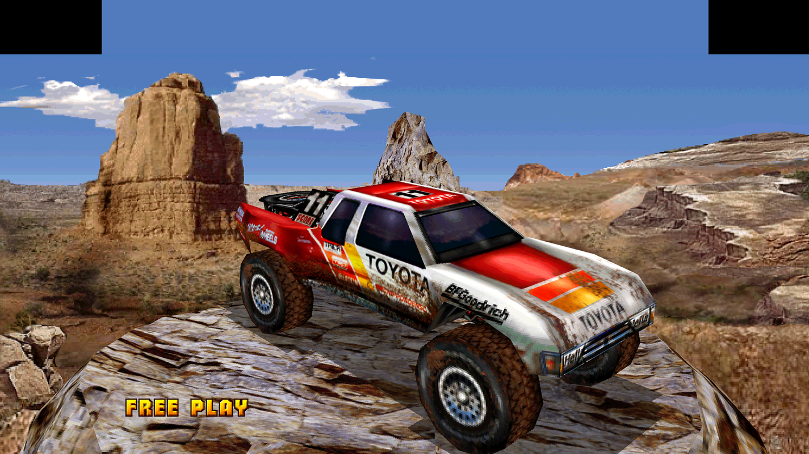
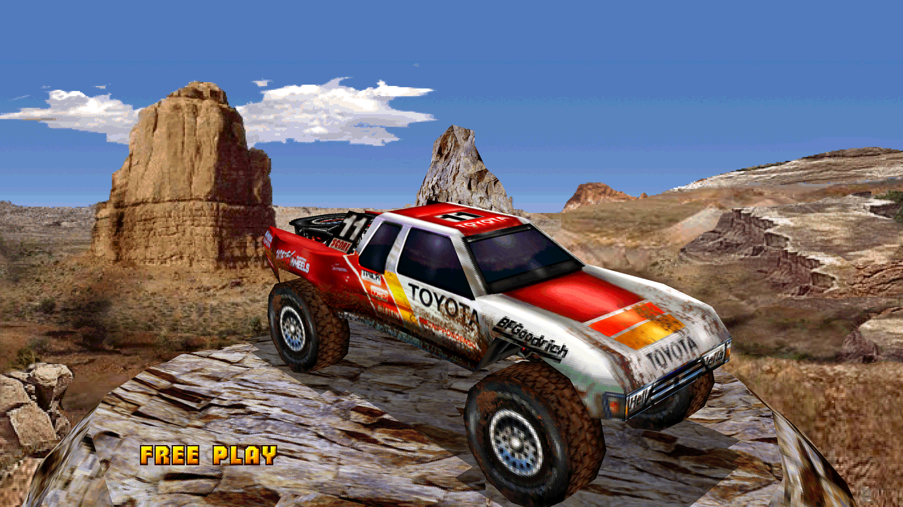
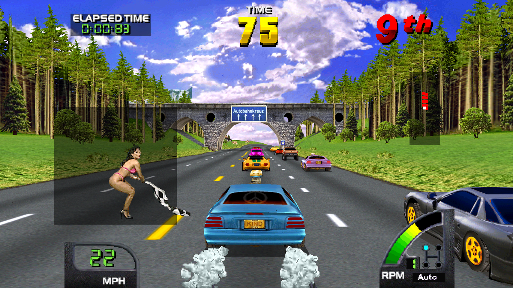
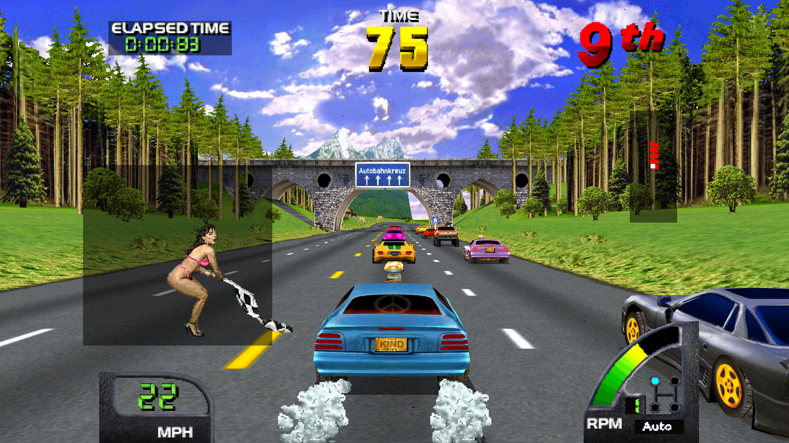

# World rendering, replay fidelity and Off Road sky — September 6, 2026

The Germany recording is intact. The rejected World visibility experiment
changed the route even with identical inputs; a fresh recording is not needed
to diagnose that. With the original World patch and the new executable, the
complete original race passes again. Three rendering fixes are ready: exact
native endpoint coverage, enhanced shadow/translucency resolve, and Off Road's
flat sky bounds. World visibility, longer distance and transmission asset
lifetime still require work before deployment.

## What is deployed

- `gpu/renderer.py` uses correctly rounded reciprocals in native exact mode.
  The two wrong pixels in the Germany frame 7280 capture are fixed. Both old
  USA captures and the new World capture verify **100.0000%**. High-resolution
  rendering retains its faster arithmetic. The CPU reference also explicitly
  handles signed coordinates and wide palette arithmetic with NumPy 2.
- Enhanced V-Unit rendering resolves actual alternating dither samples before
  the final display resize. This removes checkerboard/moire patterns from
  shadows and translucent car-position panels. Only pixels marked as hardware
  dither participate; opaque checkerboard artwork is preserved. Exact mode
  remains unchanged. Zeus uses separate shaders and is unaffected.
- Off Road's sky background now reaches the widescreen edges. This is a
  four-instruction operand change plus a prerequisite guard in its game patch.
  It changes one flat blue rectangle's X coordinates from 0..512 to -86..598.
  It adds no instructions or draw calls, and leaves Y, palette, texture and
  draw order intact. It does not stretch sky textures or restore Margin Fill.

The executable is `E:/Source/mame-src/vunit.exe`, native commit
`f40c28f8e0a3b13a8d8aece8d11db9dfa006147b`, SHA256
`4553e2afb939e4fea88238b62c1180b9c2e3dcc9bee58c102fed49c878237893`.
The Stream Deck launcher uses this source tree and executable. Off Road's patch
is read on the next launch; no additional build is needed for that patch.
The racing installation's separate `mame.exe` was not touched. Toolkit remains
v0.11.1; no force direction, cabinet configuration or physical-force tuning changed.

## Why the Germany replay went off course

The user noticed veering around 54 seconds on the external replay clock. The
candidate extended whole-object horizontal visibility, before the guest generated
polygons. It recovered missing margin geometry in carefully matched late-patch
captures, but a full race changed subsequent game state.

| Control | Result |
|---|---|
| Original INP + original World patch | Original race reproduced |
| Original INP + wider object visibility | Camera first differs at frame 2732, about 47.16 external seconds |
| Re-recorded candidate INP + wider visibility | Same camera trace as directly replaying the original INP with that patch |
| Replacement left helper with original bounds | Original camera and sampled native images reproduced |
| Right extension alone | First camera difference 2732 |
| Left extension alone | First camera difference 2732; full race diverges |

All 4,503 actual ADC reads in the 1800..3300 window have identical values and
reader PCs in the original and widened runs. Their emulated read times start
differing by 40 ns at frame 1802. Camera position differs later, before the visible
departure; orientation initially still agrees. This isolates additional admitted
guest drawing work as the trigger. It does **not** yet identify the precise
timer or state dependency. The helper alone and input re-recording do not
explain the divergence. Do not compensate by altering the user's steering.

The normal World 2.4/2.5 patch files have been restored. The new helper is retained
only in `patch/game/crusnwld-object-visibility-experimental.txt`. It is not exposed
as a normal setting and is not a new regression reference. The interrupted
`world-visibility-germany-candidate` identity run remains a failed experiment.

The final executable with the original patch passes all 9,269 inputs/timestamps
and 154 native screenshots. The full driving comparison also matches 7,401 camera
samples and 22,203 actual ADC reads, including exact read timestamps, over
frames 1800..9200. Evidence: `world-final-faithful-germany` and
`world-final-faithful-motion.json` under `results/diagnostics/`.

`lua/world_motion_trace.lua` and `harness/compare_world_motion.py` now make this
check repeatable. Missing, duplicate or truncated camera rows fail. ADC values,
PCs and precise times are reported separately. Camera equality is a strong route
check, not proof that every internal physics variable agrees. `derive_case.py`
preserves the original and explicitly reports only candidate repeatability;
identity replay alone cannot certify the original route.

## World missing road and the 1:37 report

The earlier black road hole at frame 7280 /125.67 external seconds has no current
covering polygon. Increasing the two old big-polygon left rejection limits had
zero effect. The missing geometry is rejected earlier, at whole-object sphere
tests around program words B9/C0/C4.

The bounded horizontal extension changes 512 to 598 on the right and permits a
leftmost bound of -86. A helper in unreachable alignment padding 108..10D performs
the left test. Three matched captures demonstrate actual added geometry:

| Capture | Added quads | Original draws/order | Native/resource result |
|---|---:|---|---|
| Germany 5940 | 9 | Preserved | All RAM identical |
| Germany 7280 | 173 | Preserved | Two VRAM words changed, both inside newly admitted geometry; textures/palette identical |
| World 2.5 frame 4800 | 1 | Preserved | All RAM identical |

The two new native-edge slivers at 7280 explain why strict margin-only verification
correctly failed. `verify_scene_extension.py --object-visibility` explicitly
permits this case only when previous page history, every original draw and order,
textures and palette agree, and every changed native word lies within new-quad
coverage. Spatial attribution does not certify appearance or route equivalence.

The user's 1:37 refers to the **game ELAPSED TIME display**, not 97 external seconds.
Actual GL captures around frames 7320..7360 reproduce the small black left road
wedge. A neighboring matched 7340 capture adds 50 off-screen quads with all RAM
and originals unchanged, including an otherwise missing rival car. That is
visibility evidence, not proof that the exact transient wedge is fixed: the
live completed image and offline scene selection differ slightly in scene time.
Retain dense live evidence and align the exact scene before making that claim.
The final normal World build still has this residual defect.

## Transmission D/A is an asset-lifetime problem

Clean official MAME 0.286 and 0.289 reproduce the sampled corrupt frame 1320 with
the same recorded inputs. Both 1380-frame controls match all 23 native images.
This establishes that our wide renderer is not required to trigger it; original
hardware behavior is not established by those emulator controls.

The outgoing D/A panels use texture base byte 0x398200, mapped word region
0xBCC100..0xBD08FF, and palette 0x3800. Their draws continue through frame 1358.
The texture loader writes 18,432 words overlapping that region at frames 1282..1286,
from PCs B25/B27. Dense tracing captures 11,482 actual DMA submissions. The first
diagnostic incorrectly required 16 DMA words and captured none; World often
submits only the 15 used words. That failed diagnostic is retained and the probe
now rejects an empty capture.

A causal control defers those writes and the panel palette until the transition
ends. D/A art reappears correctly and the incoming garage looks normal; the title
header remains corrupt. Only sampled native frame 1320 changes, with all 1,382
inputs/timestamps equal. This is a frame-number experiment, not a product fix.
The next implementation must identify the transition/asset owner and defer or
version outgoing resources until their last use, including the title atlas.
Do not ship hardcoded recording frames or freeze a previous screen image.

Official controls used releases from the
[MAME 0.286 release](https://github.com/mamedev/mame/releases/tag/mame0286) and
[MAME 0.289 release](https://github.com/mamedev/mame/releases/tag/mame0289).
Archives and dependency hashes are retained locally; no existing deployment was replaced.

## Distance: an actual mountain extension and a concrete constraint

World's current far limit is 80,000, with model detail thresholds 10,000/15,000.
The Germany object trace contains 349,365 samples across 900 render frames and 701
objects. 15,914 samples from 106 objects lie beyond 80,000 but within 160,000; the
largest observed depth-minus-radius is 122,528. 28 model transitions were observed.
These are resident objects reaching this test, not an inventory of unloaded scenery.

Raising the far word alone to 100,000 produces giant stray polygons. World uses
a 5,000-entry reciprocal projection table, and its fast path can index beyond it.
The slower clipped paths also clamp at index 4,999. New visibility needs valid
projection values as well as a changed distance comparison.

A matched control keeps the old fast-path safety limit: 163 new quads appear at
frame 2060 and all 1,750 originals/order remain intact. However, clamping distant
projection to the old endpoint makes the mountain oversized. A second bounded
experiment supplies entries 5000..6250 only at verified projection read sites,
without overwriting adjacent game RAM, and raises the five clamp pairs. It makes
2,651 extended reads and visibly brings in the mountain with corrected perspective.

This remains `lua/world_projection_distance.lua`, a World 2.4 diagnostic. The new
table values follow the original tail's six-decimal reciprocal convention; one
of 2,000 checked original tail entries has a historical rounding exception.
Original entries are untouched. The short window is not full-route validation,
and geometry near the newly visible mountain base still needs motion review.
No World distance switch is enabled in the product.

The long-term target for all four games is **no noticeable pop-in over validated
routes**, rather than an arbitrary larger number. Work needed:

1. Trace the drawing-work dependency that changes World/USA route state. Evaluate
   adding scenery through the host renderer without adding guest simulation work.
2. Extend projection safely, then follow object residency and track-section
   selection. A farther clip plane cannot draw an object absent from the list.
3. Treat distant background mountains separately from near traffic/detail. Stable
   distant models or deliberate transitions may help where original section
   admission remains abrupt; do not use broad texture smearing.
4. Validate each ROM revision and representative real routes, measuring first
   visible object size, popping events, frame pacing, memory and route agreement.
   The existing Germany recording is sufficient for the next causal experiments.
   Additional World/Off Road/Exotica routes will broaden acceptance later.

## Verification and limits

Compact proof is in `results/proof/2026-09-06-world-visibility/`. Full captures,
original and failed controls remain under ignored `results/diagnostics/`.
The native patch export contains 108 patches and reconstructs exactly tree
`79f28f8dc867012d19be9807d4a3df7980c12372` from `mame0286`. Generated shader
headers match canonical Python source; native helpers and toolkit pin match.

The local harness has 59 passing tests and the GPU quality check has 20 passing
cases, including native endpoint coverage, tagged dither and real checkerboard
artwork at multiple output sizes. The final Germany route and Off Road 6000-frame
run pass; Off Road has 100 matching native images and 9 completed sky captures,
with no dropped messages. The final executable also passes USA original/widescreen (5,012 inputs and 83
native images each), World 2.4/2.5 synthetic driving (6,000/100 each), and Exotica
(6,000 inputs and 21 completed GL images). All configured timing gates pass.
See `final-regressions.json` for the exact scope. This covers the listed routes and images, not every track
or physical wheel. All automated runs disable force output.
